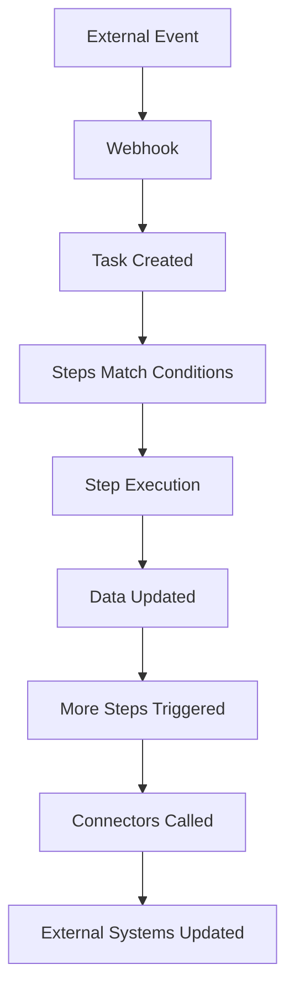

# Workspace Architecture & Management

## Workspace Architecture & Management

### Workspace Architecture & Management

**Workspaces are ALOMA's foundational organizational units that provide complete isolation and management for your automations. Understanding workspace architecture is essential for building scalable, secure, and maintainable automation systems.**

Workspaces serve as isolated environments where automations run independently, with their own data, integrations, and execution contexts. This architecture enables teams to organize work by environment, project, client, or any logical boundary while ensuring complete separation and security.

***

### Understanding Workspace Architecture

#### Core Components

Every ALOMA workspace contains six essential components that work together to create complete automation environments:

**1. Steps - Automation Logic**

JavaScript code modules that define conditional execution logic:

```javascript
// Each step contains condition + content
export const condition = {
  customer: { email: String, validated: null }
};

export const content = async () => {
  // Automation logic here
  data.customer.validated = true;
};
```

**2. Tasks - Data & Execution**

JSON objects that flow through your automation and trigger step execution:

```json
{
  "customer": {
    "email": "user@example.com",
    "status": "new"
  },
  "source": "webhook"
}
```

**3. Connectors - External Integrations**

Pre-configured integrations to external services with managed authentication:

```bash
# Each workspace has its own connector instances
aloma connector list
# - HubSpot (Production API)
# - Slack (Sales Channel)  
# - Gmail (Support Email)
```

**4. Webhooks - Real-time Data Input**

HTTP endpoints that receive external data and create tasks:

```
https://connect.aloma.io/event/{webhook-id}
```

**5. Libraries - Reusable Code**

Shared JavaScript modules for common functionality:

```javascript
// Available across all steps in the workspace
const isValid = lib.validation.validateEmail(data.customer.email);
const formatted = lib.utilities.formatDate(new Date());
```

**6. Configuration - Environment & Secrets**

Workspace-specific environment variables and sensitive data:

```bash
# Environment variables
API_ENDPOINT=https://api.prod.company.com
LOG_LEVEL=info

# Secrets (encrypted)
STRIPE_SECRET_KEY=sk_live_...
DATABASE_PASSWORD=...
```

#### Isolation Architecture

**Complete Separation**

Workspaces operate in complete isolation - no component can access resources from other workspaces:

```javascript
// ❌ This cannot work - workspaces are completely isolated
export const content = async () => {
  // Cannot access steps from other workspaces
  // Cannot use connectors from other workspaces  
  // Cannot read data from other workspace tasks
  // Cannot access libraries from other workspaces
};
```

This isolation provides:

* **Security** - Sensitive data and credentials remain contained
* **Reliability** - Failures in one workspace don't affect others
* **Scalability** - Workspaces can be optimized independently
* **Team Independence** - Different teams can work without conflicts

**Data Flow Within Workspaces**



***

### Workspace Management

#### Creating and Managing Workspaces

**CLI Workspace Operations**

```bash
# Create new workspace
aloma workspace add "Customer Onboarding Production" --tags "production,crm,critical"

# List all workspaces
aloma workspace list

# Show current workspace details
aloma workspace show

# Switch between workspaces
aloma workspace switch "Customer Onboarding Production"
aloma workspace switch ws_abc123def456  # By ID

# Update workspace settings
aloma workspace update --name "Updated Production Name"
aloma workspace update --tags "production,crm,updated,v2"

# Archive/unarchive workspaces
aloma workspace archive "Old Development"
aloma workspace archive "Old Development" --unarchive

# Delete workspace (permanent)
aloma workspace delete "Unused Workspace"
```

**Workspace Naming Conventions**

**✅ Effective Naming Patterns:**

```bash
# Environment + Purpose + Context
aloma workspace add "OrderProcessing Production"
aloma workspace add "CustomerOnboarding Development" 
aloma workspace add "PaymentFlow Staging"

# Client + Project + Environment
aloma workspace add "ACME Corp Integration Production"
aloma workspace add "TechStart Automation Development"

# Team + Function + Environment
aloma workspace add "Sales Team CRM Production"
aloma workspace add "Marketing Automation Staging"
```

**❌ Avoid These Patterns:**

```bash
# Too vague
aloma workspace add "Test"
aloma workspace add "MyWorkspace"

# Environment mixing (dangerous)
aloma workspace add "All Environments"
aloma workspace add "Mixed Data"
```

#### Workspace Organization Strategies

**Environment-Based Organization**

**Standard Development Pipeline:**

```bash
# Create environment-specific workspaces
aloma workspace add "MyApp Development" --tags "dev,myapp,testing"
aloma workspace add "MyApp Staging" --tags "staging,myapp,integration"  
aloma workspace add "MyApp Production" --tags "production,myapp,live"
```

**Environment Characteristics:**

| Environment     | Purpose             | Data                 | Monitoring      | Access          |
| --------------- | ------------------- | -------------------- | --------------- | --------------- |
| **Development** | Feature development | Test/mock data       | Basic logging   | Developers      |
| **Staging**     | Integration testing | Production-like data | Full monitoring | Dev + QA teams  |
| **Production**  | Live operations     | Real customer data   | Full alerting   | Operations team |

**Project-Based Organization**

**Multi-Project Structure:**

```bash
# Separate projects or product lines
aloma workspace add "E-commerce Platform Production" --tags "ecommerce,production"
aloma workspace add "Mobile App Backend Production" --tags "mobile,production"
aloma workspace add "Data Pipeline Production" --tags "analytics,production"

# Development environments for each
aloma workspace add "E-commerce Platform Development" --tags "ecommerce,development"
aloma workspace add "Mobile App Backend Development" --tags "mobile,development"
```

**Client-Based Organization**

**Multi-Tenant Structure:**

```bash
# Client-specific workspaces
aloma workspace add "ACME Corp Production" --tags "client,acme,production"
aloma workspace add "TechStart Production" --tags "client,techstart,production"
aloma workspace add "GlobalCorp Production" --tags "client,globalcorp,production"

# Shared development workspace
aloma workspace add "Multi-Client Development" --tags "shared,development"
```

***

### Configuration Management

#### Environment Variables

**Workspace-Specific Configuration**

Each workspace maintains independent environment variables:

```bash
# Set environment variables for current workspace
aloma workspace update --env-var "API_ENDPOINT=https://api.prod.company.com"
aloma workspace update --env-var "DATABASE_URL=postgresql://prod-db:5432/app"
aloma workspace update --env-var "LOG_LEVEL=info"
aloma workspace update --env-var "ENVIRONMENT=production"
```

**Accessing Configuration in Steps**

```javascript
export const condition = {
  integration: {
    type: "api_call",
    service: "external_service"
  }
};

export const content = async () => {
  // Get workspace-specific configuration
  const apiEndpoint = task.config('API_ENDPOINT');
  const databaseUrl = task.config('DATABASE_URL');
  const logLevel = task.config('LOG_LEVEL');
  const environment = task.config('ENVIRONMENT');
  
  console.log(`Processing in ${environment} environment`);
  console.log(`Using endpoint: ${apiEndpoint}`);
  
  // Environment-specific logic
  if (environment === 'production') {
    // Production-only features
    await connectors.analytics.track({
      event: 'api_call_made',
      endpoint: apiEndpoint
    });
  }
  
  // Make API call using workspace-specific endpoint
  const response = await connectors.httpClient.request({
    url: `${apiEndpoint}/customers`,
    method: 'POST',
    body: JSON.stringify(data.integration.payload)
  });
  
  data.integration.response = response;
  data.integration.completedAt = new Date().toISOString();
};
```

#### Secrets Management

**Secure Credential Storage**

```bash
# Add secrets to current workspace
aloma secret add "STRIPE_SECRET_KEY" "sk_live_abc123..."
aloma secret add "DATABASE_PASSWORD" "secure_password_here"
aloma secret add "WEBHOOK_SECRET" "webhook_secret_here"
aloma secret add "ENCRYPTION_KEY" "aes256_key_here"

# List secrets (values hidden)
aloma secret list

# Delete secrets when no longer needed
aloma secret delete "OLD_API_KEY"
```

**Using Secrets in Steps**

```javascript
export const condition = {
  payment: {
    type: "credit_card",
    amount: Number
  }
};

export const content = async () => {
  // Access secrets securely
  const stripeSecretKey = task.config('STRIPE_SECRET_KEY');
  const encryptionKey = task.config('ENCRYPTION_KEY');
  
  // Process payment using workspace-specific credentials
  const charge = await connectors.stripe.createCharge({
    amount: data.payment.amount * 100, // Convert to cents
    currency: 'usd',
    source: data.payment.token,
    // Stripe automatically uses the secret key from connector config
  });
  
  data.payment.chargeId = charge.id;
  data.payment.status = charge.status;
  data.payment.processedAt = new Date().toISOString();
  
  // Encrypt sensitive data before storage
  if (data.payment.cardInfo) {
    data.payment.encryptedCardInfo = encrypt(
      JSON.stringify(data.payment.cardInfo), 
      encryptionKey
    );
    delete data.payment.cardInfo; // Remove plain text
  }
};
```

***

### Infrastructure as Code

#### Deploy File Architecture

**Complete Workspace Definition**

Define entire workspace configurations in YAML:

```yaml
# deploy-production.yaml
workspaces:
  - name: "Customer Processing Production"
    tags: ["production", "customer-processing", "critical"]
    
    # Steps configuration
    steps:
      - syncPath: "steps/"
    
    # Libraries configuration
    libraries:
      - syncPath: "libraries/"

    # Connectors configuration
    connectors:
      - connectorName: "hubspot.com (private)"
        name: "Production HubSpot"
        config:
          apiToken: "${HUBSPOT_API_TOKEN}"
      - connectorName: "E-Mail (SMTP - OAuth)"
        name: "Production Email"
      - connectorName: "slack.com"
        name: "Production Slack"
    
    # Secrets configuration
    secrets:
      - name: "DATABASE_URL"
        value: "${PROD_DATABASE_URL}"
        description: "Production database connection"
        encrypted: true
      - name: "ENCRYPTION_KEY"
        value: "${PROD_ENCRYPTION_KEY}"
        description: "Data encryption key"
        encrypted: true
      - name: "SLACK_CHANNEL"
        value: "C1234567890"
        description: "Production alerts channel"
        encrypted: false
    
    # Environment variables
    environment:
      - name: "API_ENDPOINT"
        value: "https://api.prod.company.com"
      - name: "LOG_LEVEL"
        value: "info"
      - name: "ENVIRONMENT"
        value: "production"
    
    # Webhooks configuration
    webhooks:
      - name: "Customer Events"
        description: "Receives customer lifecycle events"
      - name: "Order Processing"
        description: "Handles order status updates"
    
    # Test tasks for validation
    tasks:
      - name: "production health check"
        data: {
          "healthCheck": true, 
          "environment": "production",
          "timestamp": "2025-01-15T10:00:00Z"
        }
```

**Environment-Specific Deploy Files**

```bash
# Create environment-specific configurations
# deploy-development.yaml
# deploy-staging.yaml  
# deploy-production.yaml
```

**Development Environment:**

```yaml
# deploy-development.yaml
workspaces:
  - name: "Customer Processing Development"
    tags: ["development", "customer-processing", "testing"]
    
    connectors:
      - connectorName: "hubspot.com (private)"
        config:
          apiToken: "${DEV_HUBSPOT_API_TOKEN}"  # Different credentials
    
    environment:
      - name: "API_ENDPOINT"
        value: "https://api.dev.company.com"    # Different endpoint
      - name: "LOG_LEVEL"
        value: "debug"                          # More verbose logging
      - name: "ENVIRONMENT"
        value: "development"
```

#### Deployment Workflows

**Multi-Environment Deployment**

```bash
# Set environment-specific variables
export HUBSPOT_API_TOKEN="dev-token-here"
export DEV_DATABASE_URL="postgresql://dev-db:5432/app"

# Deploy to development
aloma deploy deploy-development.yaml

# Verify development deployment
aloma workspace switch "Customer Processing Development"
aloma workspace show
aloma step list
aloma connector list
```

```bash
# Set staging variables
export HUBSPOT_API_TOKEN="staging-token-here"
export STAGING_DATABASE_URL="postgresql://staging-db:5432/app"

# Deploy to staging
aloma deploy deploy-staging.yaml

# Run integration tests in staging
aloma task new "staging integration test" -f tests/integration-test.json
```

```bash
# Set production variables
export HUBSPOT_API_TOKEN="prod-token-here"
export PROD_DATABASE_URL="postgresql://prod-db:5432/app"
export PROD_ENCRYPTION_KEY="production-encryption-key"

# Deploy to production
aloma deploy deploy-production.yaml

# Verify production deployment
aloma workspace switch "Customer Processing Production"
aloma workspace show
```

**Git Integration Workflow**

```bash
# 1. Develop locally
aloma workspace switch "Development"
aloma step pull -p ./steps

# 2. Make changes and test
# Edit steps in IDE
aloma step sync -p ./steps

# 3. Commit and push
git add .
git commit -m "Add customer validation logic"
git push origin develop

# 4. Deploy to staging
git checkout staging
git merge develop
aloma workspace switch "Staging"
aloma deploy deploy-staging.yaml

# 5. Production deployment
git checkout main
git merge staging
aloma workspace switch "Production"
aloma deploy deploy-production.yaml
```

***

### Team Collaboration

#### Access Control Patterns

**Role-Based Workspace Access**

**Developer Access Pattern:**

```bash
# Developers typically access:
- Development workspaces (full access)
- Staging workspaces (deploy access)
- Production workspaces (read-only access)
```

**Operations Team Access Pattern:**

```bash
# Operations typically access:
- Staging workspaces (full access)
- Production workspaces (full access)
- Development workspaces (monitoring access)
```

**Management Access Pattern:**

```bash
# Management typically access:
- Production workspaces (read-only metrics)
- Staging workspaces (read-only monitoring)
```

**Client-Specific Access Control**

**Multi-Client Organization:**

```javascript
// ACME Corp workspace - isolated client processing
export const condition = {
  order: {
    client: "acme",
    status: "new"
  }
};

export const content = async () => {
  // ACME-specific processing with isolated credentials
  const acmeConfig = {
    taxRate: 0.08,
    shippingCarrier: 'FedEx',
    fulfillmentCenter: 'acme-warehouse-east'
  };
  
  console.log('Processing ACME Corp order');
  
  // Use ACME-specific connectors (separate credentials)
  await connectors.acmeInventory.checkStock({
    items: data.order.items,
    warehouse: acmeConfig.fulfillmentCenter
  });
  
  data.order.client = "acme";
  data.order.taxRate = acmeConfig.taxRate;
  data.order.fulfillmentCenter = acmeConfig.fulfillmentCenter;
  data.order.processedAt = new Date().toISOString();
};
```

#### Development Workflow Patterns

**Feature Development Workflow**

```bash
# 1. Create feature branch workspace
aloma workspace add "Feature-CustomerValidation Dev" --tags "feature,development"

# 2. Develop feature
aloma workspace switch "Feature-CustomerValidation Dev"
aloma step pull -p ./steps
# Edit and test feature

# 3. Integration testing
aloma workspace switch "Integration Testing"
aloma step sync -p ./steps
# Run integration tests

# 4. Merge to main development
aloma workspace switch "Development"
aloma step sync -p ./steps
```

**Hotfix Workflow**

```bash
# 1. Create hotfix workspace from production
aloma workspace add "Hotfix-CriticalBug Staging" --tags "hotfix,staging"

# 2. Apply hotfix
aloma workspace switch "Hotfix-CriticalBug Staging"
aloma step pull -p ./steps
# Apply urgent fix and test

# 3. Deploy to production
aloma workspace switch "Production"
aloma step sync -p ./steps
```

***

### Monitoring and Observability

#### Workspace Health Monitoring

**Health Check Implementation**

```bash
# Enable workspace health monitoring
aloma workspace update --health-enabled true
aloma workspace update --notification-groups "devops@company.com,alerts@company.com"

# Create automated health checks
aloma task new "Workspace Health Check" -d '{
  "healthCheck": true,
  "timestamp": "'$(date -u +%Y-%m-%dT%H:%M:%SZ)'",
  "automated": true,
  "workspace": "'$(aloma workspace show --name-only)'"
}'
```

**Health Check Step Implementation**

```javascript
// Health monitoring step
export const condition = {
  healthCheck: true
};

export const content = async () => {
  const workspaceName = task.workspace();
  const healthMetrics = {
    timestamp: new Date().toISOString(),
    workspace: workspaceName,
    
    // Task metrics
    tasks: {
      running: await getTaskCount('running'),
      completed: await getTaskCount('done'),
      failed: await getTaskCount('error'),
      pending: await getTaskCount('pending')
    },
    
    // Step metrics
    steps: {
      total: await getStepCount(),
      active: await getActiveStepCount(),
      errorRate: await getStepErrorRate()
    },
    
    // Connector metrics
    connectors: await getConnectorHealth(),
    
    // Performance metrics
    performance: {
      avgExecutionTime: await getAvgExecutionTime(),
      taskThroughput: await getTaskThroughput(),
      errorRate: await getErrorRate()
    }
  };
  
  // Store health metrics
  data.healthMetrics = healthMetrics;
  
  // Alert on thresholds
  if (healthMetrics.performance.errorRate > 0.05) { // 5% error rate
    await alertOpsTeam('High error rate detected', healthMetrics);
  }
  
  if (healthMetrics.tasks.failed > 50) { // 50 failed tasks
    await alertOpsTeam('High failure count detected', healthMetrics);
  }
  
  console.log(`Health check complete for ${workspaceName}:`, JSON.stringify(healthMetrics, null, 2));
  
  data.healthCheckComplete = true;
};

async function alertOpsTeam(message, metrics) {
  await connectors.slack.send({
    channel: '#ops-alerts',
    text: `🚨 ${message}`,
    attachments: [{
      color: 'danger',
      fields: [
        { title: 'Workspace', value: metrics.workspace, short: true },
        { title: 'Error Rate', value: `${(metrics.performance.errorRate * 100).toFixed(2)}%`, short: true },
        { title: 'Failed Tasks', value: metrics.tasks.failed.toString(), short: true },
        { title: 'Timestamp', value: metrics.timestamp, short: true }
      ]
    }]
  });
}
```

#### Performance Monitoring

**Workspace-Level Metrics**

```javascript
// Performance tracking step
export const condition = {
  trackPerformance: true
};

export const content = async () => {
  const metrics = {
    workspace: task.workspace(),
    timestamp: new Date().toISOString(),
    
    // Execution metrics
    execution: {
      totalTasks: data.performanceTracking?.totalTasks || 0,
      avgExecutionTime: data.performanceTracking?.avgExecutionTime || 0,
      taskThroughput: await calculateTaskThroughput(),
      peakHourThroughput: await getPeakHourThroughput()
    },
    
    // Resource utilization
    resources: {
      stepExecutionCount: await getStepExecutionCount(),
      connectorCallCount: await getConnectorCallCount(),
      dataVolumeProcessed: await getDataVolumeProcessed()
    },
    
    // Quality metrics
    quality: {
      successRate: await getSuccessRate(),
      retryRate: await getRetryRate(),
      timeoutRate: await getTimeoutRate()
    }
  };
  
  // Store performance data
  data.performanceMetrics = metrics;
  
  // Performance optimization alerts
  if (metrics.execution.avgExecutionTime > 30000) { // 30 seconds
    await notifyPerformanceIssue('High execution time', metrics);
  }
  
  if (metrics.quality.successRate < 0.95) { // 95% success rate threshold
    await notifyPerformanceIssue('Low success rate', metrics);
  }
  
  console.log('Performance metrics collected:', JSON.stringify(metrics, null, 2));
  
  data.performanceTrackingComplete = true;
};
```

***

### Best Practices

#### Workspace Organization Guidelines

**✅ Recommended Practices**

**1. Environment Separation**

```bash
# Always separate environments
aloma workspace add "MyApp Development" --tags "dev,myapp"
aloma workspace add "MyApp Staging" --tags "staging,myapp"
aloma workspace add "MyApp Production" --tags "prod,myapp"
```

**2. Descriptive Naming**

```bash
# Clear, descriptive names
aloma workspace add "E-commerce Order Processing Production"
aloma workspace add "Customer Support Automation Development"
```

**3. Consistent Tagging**

```bash
# Consistent tag strategy
--tags "environment,project,team,criticality"
--tags "production,ecommerce,sales,critical"
--tags "development,crm,marketing,normal"
```

**4. Configuration Management**

```javascript
// Use environment variables consistently
const apiEndpoint = task.config('API_ENDPOINT');
const environment = task.config('ENVIRONMENT');

// Environment-specific logic
if (environment === 'production') {
  // Production-only features
}
```

**❌ Practices to Avoid**

**1. Environment Mixing**

```bash
# Never mix environments
# ❌ aloma workspace add "All Environments Mixed"
```

**2. Vague Naming**

```bash
# Avoid unclear names
# ❌ aloma workspace add "Test"
# ❌ aloma workspace add "MyWorkspace"
```

**3. Hardcoded Values**

```javascript
// ❌ Don't hardcode environment-specific values
const prodUrl = 'https://api.prod.company.com'; // Won't work in dev

// ✅ Use configuration instead
const apiUrl = task.config('API_ENDPOINT');
```

**4. Shared Credentials**

```bash
# ❌ Don't share credentials between environments
# Each workspace should have its own secrets
```

#### Security Best Practices

**Credential Management**

**1. Environment-Specific Credentials**

```bash
# Development credentials
aloma workspace switch "Development"
aloma secret add "API_KEY" "dev_key_here"

# Production credentials (different)
aloma workspace switch "Production"  
aloma secret add "API_KEY" "prod_key_here"
```

**2. Least Privilege Access**

```bash
# Only grant necessary access
# Developers: dev + staging (limited prod)
# Operations: staging + prod
# Clients: only their dedicated workspaces
```

**3. Secret Rotation**

```bash
# Regular secret rotation
aloma secret delete "OLD_API_KEY"
aloma secret add "API_KEY" "new_rotated_key"
```

**Data Protection**

**1. Sensitive Data Handling**

```javascript
// Properly handle sensitive data
export const content = async () => {
  // Process sensitive data
  const result = await processPayment(data.payment);
  
  // Store only necessary data
  data.payment = {
    id: result.id,
    status: result.status,
    // Don't store full card details
  };
  
  // Use secrets for sensitive operations
  const encryptionKey = task.config('ENCRYPTION_KEY');
  if (result.sensitiveData) {
    data.payment.encrypted = encrypt(result.sensitiveData, encryptionKey);
  }
};
```

**2. Audit Trail Maintenance**

```javascript
// Maintain audit trails
export const content = async () => {
  // Log important actions (without sensitive data)
  console.log(`Payment processed: ${data.payment.id}`);
  
  // Track processing metadata
  data.audit = {
    processedAt: new Date().toISOString(),
    processedBy: task.workspace(),
    operation: 'payment_processing'
  };
};
```

#### Performance Optimization

**Resource Management**

**1. Efficient Step Design**

```javascript
// Optimize step conditions for performance
export const condition = {
  order: {
    status: "pending",
    priority: "high"  // Specific conditions reduce unnecessary executions
  }
};
```

**2. Connector Optimization**

```javascript
// Batch connector operations when possible
export const content = async () => {
  // Batch process multiple items
  const results = await connectors.crm.bulkCreate(data.customers);
  
  // Update all at once
  data.customers.forEach((customer, index) => {
    customer.crmId = results[index].id;
  });
};
```

**3. Memory Management**

```javascript
// Manage large data efficiently
export const content = async () => {
  // Process data in chunks
  const chunkSize = 100;
  for (let i = 0; i < data.items.length; i += chunkSize) {
    const chunk = data.items.slice(i, i + chunkSize);
    await processChunk(chunk);
  }
  
  // Clean up large temporary data
  delete data.largeTemporaryData;
};
```

This comprehensive workspace architecture enables teams to build scalable, secure, and maintainable automation systems that grow with organizational needs while maintaining operational excellence.
