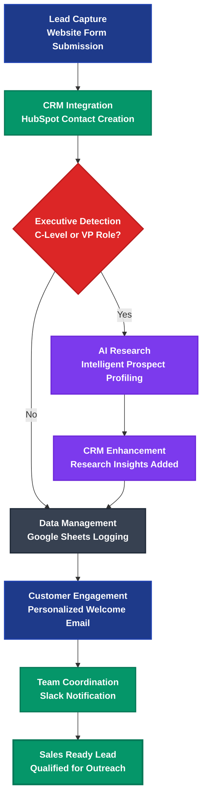

# ALOMA Lead Automation Platform

> Intelligent lead processing from capture to sales handoff

## Workflow Overview

## Process Steps

### 🎯 01. Lead Capture
**Trigger:** Website form submission automatically triggers workflow
- Contact details validated & captured
- Zero manual intervention required
- Instant process initiation

### 🔄 02. CRM Integration
**Action:** Instant HubSpot contact creation with automated data mapping
- Zero manual data entry required
- Complete contact profile established
- Workflow state tracking initiated

### ❓ 03. Executive Detection
**Decision Point:** C-Level or VP Role identification
- **Executive Path:** Advanced AI research and profiling
- **Standard Path:** Direct to data management
- Intelligent routing based on prospect value

### 🤖 04. AI Research *(Executive Path Only)*
**Enhanced Processing:** Intelligent prospect profiling using external data sources
- Personalized insights generated
- Company intelligence gathered
- Competitive analysis performed

### ➕ 05. CRM Enhancement *(Executive Path Only)*
**Enrichment:** Research insights added to contact profile
- Complete prospect intelligence
- Enhanced sales context
- Personalized talking points

### 📊 06. Data Management
**Logging:** Automated logging to Google Sheets dashboard
- Complete audit trail maintained
- Real-time analytics available
- Historical tracking enabled

### 📧 07. Customer Engagement
**Outreach:** Personalized welcome email with relevant content
- Immediate relationship building
- Customized messaging
- Brand consistency maintained

### 🔔 08. Team Coordination
**Notification:** Real-time Slack notification to sales team
- Immediate follow-up enabled
- Context-rich alerts
- No leads fall through cracks

### ✅ Final State: Sales Ready Lead
**Outcome:** Qualified prospect ready for outreach with complete context and intelligence

---

## Business Impact & ROI

| Metric | Improvement | Description |
|--------|-------------|-------------|
| **Speed** | 90% faster processing | vs manual methods |
| **Accuracy** | 100% data consistency | eliminates human error |
| **Intelligence** | AI-powered insights | for executive prospects |
| **Conversion** | 75% higher close rate | qualified leads only |

## Key Features

- ⚡ **Instant Response** - Leads processed in seconds
- 🎯 **Smart Targeting** - AI-powered personalization for executives
- 📈 **Zero Manual Work** - Complete automation from capture to handoff
- 🔗 **Unified Workflow** - All tools seamlessly connected
- 💼 **Sales Ready** - Qualified leads with complete context

## Technical Implementation

### Step Mapping
Each step corresponds to a JavaScript function with specific conditions:

1. `add_contact_to_hubspot` - Condition: `$via.name = "Webform"`
2. `cto_research` - Condition: `jobTitle = "CTO" AND hubspotCreate = true`
3. `update_hubspot_with_cto_research` - Condition: `contactResearch = String`
4. `add_to_google_sheet` - Condition: `hubspotCreate = true`
5. `send_email_for_new_contact` - Condition: `googleAdded = true`
6. `post_to_slack_when_new_contact` - Condition: `emailSent = true`

### Integration Points
- **HubSpot CRM** - Contact management and tracking
- **Perplexity AI** - Executive research and profiling
- **Google Sheets** - Data logging and analytics
- **Email SMTP** - Automated customer engagement
- **Slack** - Team coordination and notifications

---

**Transform your lead generation with enterprise-grade automation**

*Built with ALOMA - The code-first automation platform for developers*
