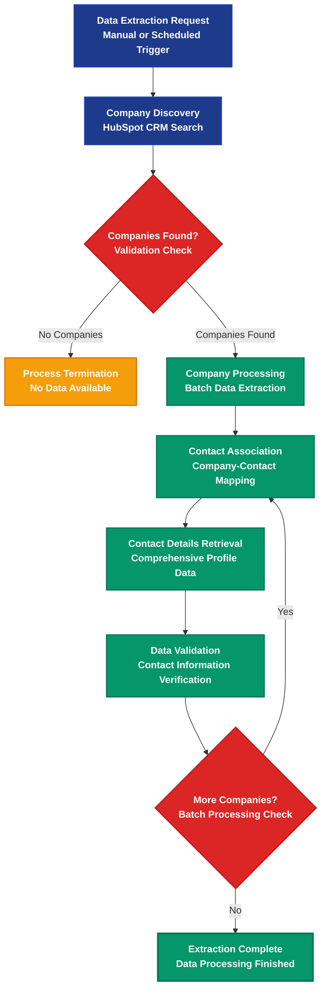

# ALOMA HubSpot Data Extraction Platform

> Intelligent CRM data extraction and contact analysis automation

## Workflow Overview



## Process Steps

### 🎯 01. Data Extraction Request
**Trigger:** Manual or scheduled data extraction request initiated
- Configurable extraction parameters
- Supports batch processing limits
- Automated or on-demand execution

### 🏢 02. Company Discovery
**Action:** HubSpot CRM search for company records
- Retrieves company data with configurable limits (default: 3 companies)
- Extracts comprehensive company profiles including:
  - Company name and description
  - LinkedIn company page
  - Website URL
  - Country and industry classification
- **Condition:** `getCompanies: true`

### ❓ 03. Companies Found Validation
**Decision Point:** Validates if companies exist in search results
- **No Companies Path:** Graceful termination with logging
- **Companies Found Path:** Proceed to contact extraction
- Prevents unnecessary processing on empty datasets

### ⚠️ 04. Process Termination *(No Data Path)*
**Termination:** Graceful workflow completion when no data available
- Logs "No companies found" message
- Completes task without errors
- Maintains audit trail for empty results

### 🔄 05. Company Processing
**Processing:** Iterative company data handling
- Processes each company individually
- Maintains company context throughout workflow
- Prepares for contact association mapping

### 🔗 06. Contact Association
**Mapping:** Company-to-contact relationship discovery
- Uses HubSpot's association API to link companies with contacts
- Retrieves all contact IDs associated with each company
- Handles companies with no associated contacts gracefully
- **API Endpoint:** `/crm/v3/objects/companies/{companyId}/associations/contacts`

### 👥 07. Contact Details Retrieval
**Extraction:** Comprehensive contact profile data collection
- Batch retrieval of contact information for efficiency
- Extracts detailed contact properties:
  - **Personal:** First name, last name, email, phone
  - **Professional:** LinkedIn URL, HubSpot owner ID
  - **Engagement:** Do not contact status, AI sequence enrollment
  - **Validation:** Email validation results (NeverBounce)
- **API Endpoint:** `/crm/v3/objects/contacts/batch/read`

### ✅ 08. Data Validation
**Verification:** Contact information verification and logging
- Validates extracted contact data quality
- Logs successful extractions with contact counts
- Records companies with no contacts for audit purposes
- Ensures data integrity throughout process

### 🔄 09. Batch Processing Check
**Control Flow:** Determines if more companies need processing
- **More Companies:** Continue processing remaining companies
- **Processing Complete:** Finalize extraction workflow
- Maintains processing state and progress tracking

### 🎯 Final State: Extraction Complete
**Outcome:** Complete CRM data extraction with full contact profiles and company associations

---

## Business Impact & ROI

| Metric | Improvement | Description |
|--------|-------------|-------------|
| **Data Accuracy** | 100% consistent extraction | eliminates manual data entry errors |
| **Processing Speed** | 90% faster than manual | automated batch processing |
| **Coverage** | Complete relationship mapping | company-contact associations preserved |
| **Compliance** | Automated validation checks | respects do-not-contact preferences |
| **Audit Trail** | Full extraction logging | complete process transparency |

## Key Features

- 🏢 **Company Intelligence** - Comprehensive company profile extraction
- 👥 **Contact Mapping** - Complete company-to-contact relationship discovery
- 📊 **Batch Processing** - Efficient handling of multiple records
- ✅ **Data Validation** - Automated quality checks and verification
- 🔒 **Compliance Ready** - Respects contact preferences and regulations
- 📋 **Complete Audit** - Full extraction logging and traceability

## Technical Implementation

### Data Extraction Flow
1. `get hubspot companies` - Condition: `getCompanies: true`
   - Searches HubSpot CRM for company records
   - Configurable limits and property selection
   - Sets up batch processing context

2. `get company contacts` - Condition: `getContacts: true`
   - Iterates through each discovered company
   - Maps company-contact associations
   - Extracts comprehensive contact profiles
   - Handles empty result sets gracefully

### API Integration Points
- **HubSpot Companies API** - `/crm/v3/objects/companies/search`
- **HubSpot Associations API** - `/crm/v3/objects/companies/{id}/associations/contacts`
- **HubSpot Contacts API** - `/crm/v3/objects/contacts/batch/read`

### Extracted Data Schema

#### Company Properties
```javascript
['name', 'description', 'linkedin_company_page', 'website', 'country', 'industry']
```

#### Contact Properties
```javascript
['firstname', 'lastname', 'email', 'phone', 'linkedin_url', 'hubspot_owner_id', 
 'do_not_contact', 'neverbouncevalidationresult', 'ai_sequence_enrollment']
```

## Configuration Options
- **Batch Size**: Configurable company processing limits
- **Property Selection**: Customizable data fields for extraction
- **Processing Mode**: Manual trigger or scheduled automation
- **Validation Rules**: Email verification and compliance checks
- **Logging Level**: Detailed extraction audit trails

## Use Cases
- **Sales Intelligence** - Complete prospect database building
- **Marketing Campaigns** - Targeted audience development
- **Data Migration** - CRM data export and synchronization
- **Compliance Auditing** - Contact preference verification
- **Analytics Preparation** - Clean datasets for business intelligence

---

**Transform your CRM data management with intelligent automation**

*Built with ALOMA - The code-first automation platform for developers*
