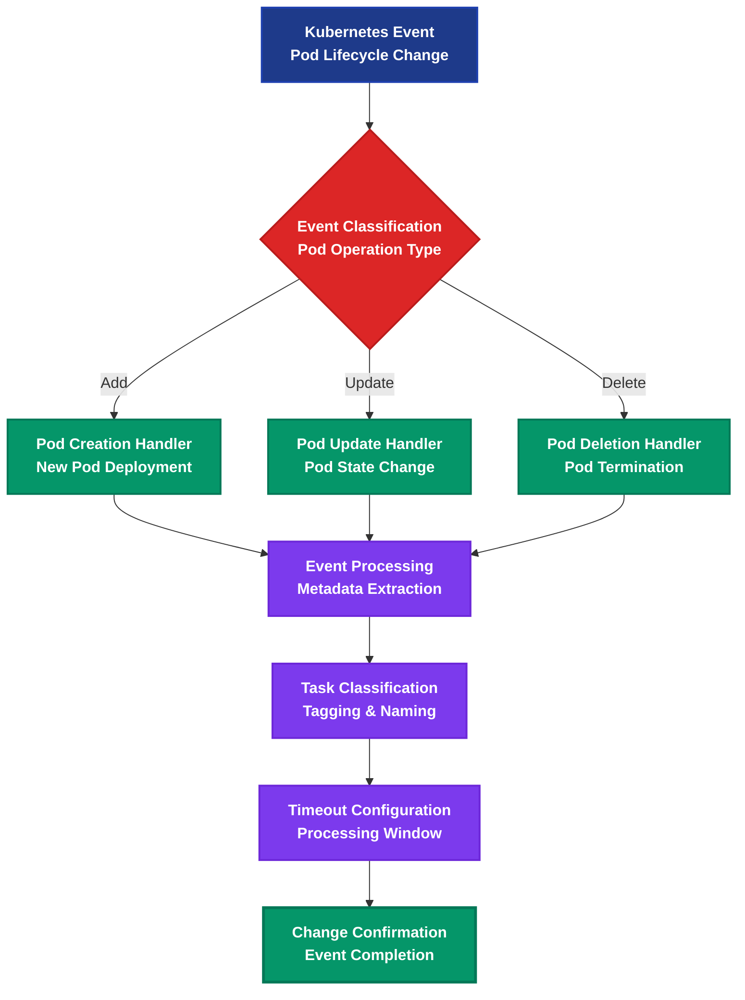

# ALOMA Kubernetes Pod Monitoring Platform

> Intelligent Kubernetes cluster monitoring and pod lifecycle automation

## Workflow Overview



## Process Steps

### 🎯 01. Kubernetes Event Reception
**Trigger:** Kubernetes cluster pod lifecycle event received via webhook
- Real-time pod state changes captured
- Complete Kubernetes resource metadata included
- Supports all pod lifecycle operations (add, update, delete)

### ❓ 02. Event Classification
**Decision Point:** Determines pod operation type for appropriate handling
- **Add Path:** New pod creation events
- **Update Path:** Pod state or configuration changes  
- **Delete Path:** Pod termination events
- Intelligent routing based on event type

### ➕ 03. Pod Creation Handler *(Add Path)*
**Processing:** Handles new pod deployment events
- Captures pod creation metadata
- Tracks deployment context and ownership
- Sets processing tags for creation events
- **Condition:** `type: 'add', item: {kind: 'Pod'}`

### 🔄 04. Pod Update Handler *(Update Path)*
**Processing:** Manages pod state and configuration changes
- Monitors pod lifecycle transitions
- Tracks configuration updates and status changes
- Handles rolling updates and scaling events
- **Condition:** `type: 'update', item: {kind: 'Pod'}`

### ❌ 05. Pod Deletion Handler *(Delete Path)*
**Processing:** Processes pod termination events
- Captures pod deletion context
- Tracks cleanup and resource deallocation
- Monitors graceful vs forced terminations
- **Condition:** `type: 'delete', item: {kind: 'Pod'}`

### 📋 06. Event Processing
**Extraction:** Comprehensive metadata and context processing
- Extracts pod name, namespace, and resource identifiers
- Processes labels, annotations, and owner references
- Captures status information and phase transitions
- Maintains complete audit trail

### 🏷️ 07. Task Classification
**Organization:** Event categorization and naming for tracking
- Dynamic task naming with pod names (e.g., "Pod added: nginx-deployment-abc123")
- Hierarchical tagging system:
  - **Resource Type:** `pod`
  - **Operation:** `add`, `update`, or `delete`
- Enables efficient filtering and monitoring

### ⏱️ 08. Timeout Configuration
**Control:** Processing window management for event handling
- Configurable timeout period (default: 2000ms)
- Prevents infinite processing loops
- Ensures resource cleanup and system stability
- Automatic completion on timeout expiration

### ✅ 09. Change Confirmation
**Completion:** Event processing finalization
- Confirms successful event classification
- Sets change processing flag (`changeClassified = true`)
- Completes task with proper status tracking
- Maintains processing metrics and audit logs

---

## Business Impact & ROI

| Metric | Improvement | Description |
|--------|-------------|-------------|
| **Monitoring Coverage** | 100% pod visibility | complete cluster lifecycle tracking |
| **Response Time** | Real-time processing | immediate event classification |
| **Operational Insight** | Complete audit trail | full pod lifecycle history |
| **Resource Efficiency** | Automated timeout handling | prevents resource leaks |
| **Troubleshooting** | Structured event logs | rapid issue identification |

## Key Features

- 🚀 **Real-time Monitoring** - Instant pod lifecycle event processing
- 🔍 **Complete Visibility** - Full Kubernetes resource metadata capture
- 🏷️ **Smart Classification** - Intelligent event categorization and tagging
- ⏱️ **Resource Management** - Automatic timeout and cleanup handling
- 📊 **Audit Trail** - Complete pod lifecycle history tracking
- 🔧 **Extensible Design** - Easy integration with additional Kubernetes resources

## Technical Implementation

### Pod Lifecycle Event Handling
1. `pod add` - Condition: `type: 'add', item: {kind: 'Pod'}`
   - Processes new pod creation events
   - Extracts deployment context and metadata
   - Tags events for creation tracking

2. `classify pod update` - Condition: `type: 'update', item: {kind: 'Pod'}`
   - Handles pod state and configuration changes
   - Monitors lifecycle transitions and updates
   - Tracks rolling deployments and scaling

3. `pod delete` - Condition: `type: 'delete', item: {kind: 'Pod'}`
   - Processes pod termination events
   - Captures deletion context and cleanup
   - Monitors graceful shutdown processes

### Kubernetes Integration
- **Event Source:** Kubernetes API server via webhook
- **Resource Types:** Pod lifecycle events (v1/Pod)
- **Event Types:** CREATE, UPDATE, DELETE operations
- **Metadata Extraction:** Complete Kubernetes resource definitions

### Extracted Metadata Schema
```javascript
{
  resourceId: String,        // Unique resource identifier
  type: String,             // Operation type: 'add', 'update', 'delete'
  item: {
    kind: 'Pod',            // Kubernetes resource type
    apiVersion: 'v1',       // API version
    metadata: {
      name: String,         // Pod name
      namespace: String,    // Kubernetes namespace
      uid: String,          // Unique identifier
      labels: Object,       // Pod labels
      ownerReferences: Array // Resource ownership
    },
    status: {
      phase: String,        // Pod lifecycle phase
      qosClass: String      // Quality of Service class
    }
  }
}
```

## Monitoring Capabilities
- **Pod Creation** - Track new deployments and scaling events
- **State Changes** - Monitor pod phase transitions (Pending → Running → Succeeded/Failed)
- **Configuration Updates** - Detect rolling updates and configuration changes
- **Resource Cleanup** - Track pod termination and resource deallocation
- **Ownership Tracking** - Monitor ReplicaSet, Deployment, and StatefulSet relationships

## Use Cases
- **DevOps Monitoring** - Real-time cluster state awareness
- **Deployment Tracking** - Automated deployment success/failure detection
- **Resource Optimization** - Pod lifecycle analysis for cost optimization
- **Troubleshooting** - Historical pod event analysis for issue resolution
- **Compliance Auditing** - Complete infrastructure change tracking

---

**Transform your Kubernetes monitoring with intelligent automation**

*Built with ALOMA - The code-first automation platform for developers*
