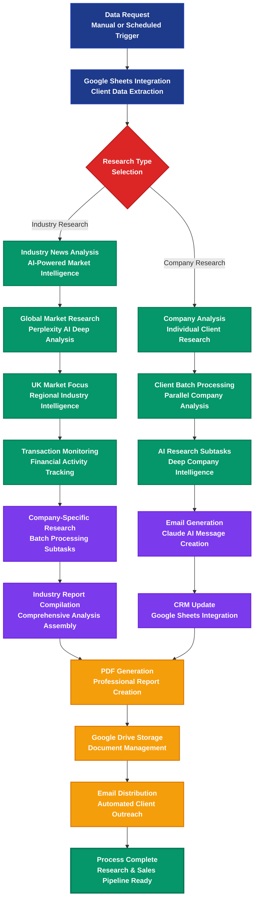

# ALOMA Bank Sales Research Automation Platform

> AI-powered research and sales intelligence automation for investment banking

## Workflow Overview



## Process Steps

### 🎯 01. Data Request Initiation
**Trigger:** Manual or scheduled research automation request
- Configurable research parameters (`getData: true`, `getIndustryNews: true`, `getCompanyNews: true`)
- Supports both industry-wide and company-specific research modes
- Automated or on-demand execution

### 📊 02. Google Sheets Integration
**Action:** Client data extraction and filtering from centralized CRM
- Extracts company data with intelligent filtering based on:
  - Business Industry Type
  - Business Development Phase
  - Processing status (Aloma processed flag)
- Configurable batch limits for processing control
- **Condition:** `getData: true`

### ❓ 03. Research Type Selection
**Decision Point:** Determines research scope and processing path
- **Industry Research Path:** Market-wide intelligence and trend analysis
- **Company Research Path:** Individual client deep-dive analysis
- Intelligent routing based on request parameters

### 🌍 04. Industry News Analysis *(Industry Path)*
**Processing:** AI-powered market intelligence gathering
- Multi-phase research approach with structured analysis
- Global and UK-specific market intelligence
- Financial transaction monitoring and trend analysis

### 🏢 05. Company Analysis *(Company Path)*
**Processing:** Individual client research and intelligence
- Parallel processing of multiple companies
- Comprehensive competitive analysis
- AI-generated sales intelligence

### 📈 06. Global Market Research *(Industry Path - Phase 1)*
**AI Analysis:** Comprehensive global market intelligence using Perplexity AI
- Top 5 global events impacting financial transactions
- Consolidation trends and financial outlook analysis
- Industry-specific news filtering with source attribution
- **Condition:** `getIndustryNews: true, nextStep: 1`
- **AI Model:** Perplexity `sonar-deep-research`

### 🇬🇧 07. UK Market Focus *(Industry Path - Phase 2)*
**Regional Intelligence:** UK-specific market analysis and regulatory monitoring
- UK industry events and regulatory changes
- Underserved customer segments analysis
- CEO/CFO changes and newly released reports
- **Condition:** `getIndustryNews: true, nextStep: 2`

### 💰 08. Transaction Monitoring *(Industry Path - Phase 3)*
**Financial Activity:** Significant transaction tracking and analysis
- Capital raising, debt issuance, M&A activity
- Company-specific financial transactions
- Strategic rationale and market impact assessment
- **Condition:** `getIndustryNews: true, nextStep: 3`
- **Batch Processing:** 4 companies per subtask cycle

### 🔍 09. Client Batch Processing *(Company Path - Phase 1)*
**Parallel Analysis:** Efficient multi-company research processing
- Configurable batch sizes (default: 3 companies)
- Parallel subtask execution for scalability
- Progress tracking and index management
- **Condition:** `getCompanyNews: true, nextStep: 1`

### 🤖 10. AI Research Subtasks *(Company Path - Phase 2)*
**Deep Intelligence:** Comprehensive company analysis using AI
- Industry segment analysis and competitive positioning
- Financial metrics and valuation research
- Recent transactions and strategic initiatives
- AI impact assessment and consolidation trends
- **Condition:** `getCompanyNews: true, nextStep: 2`
- **AI Model:** Perplexity `sonar-deep-research`

### 📧 11. Email Generation *(Company Path - Phase 3)*
**Sales Intelligence:** AI-powered personalized email creation using Claude AI
- Cold email optimization for CEO outreach
- Competitive threat analysis integration
- Subject line optimization (maximum 9 words)
- Personalized messaging (maximum 35 words)
- **Condition:** `getCompanyNews: true, nextStep: 3`
- **AI Model:** Claude `claude-3-haiku-20240307`

### 📋 12. CRM Update *(Company Path - Final)*
**Data Integration:** Automated Google Sheets CRM synchronization
- Email content and subject line insertion
- Processing status flag updates ("Aloma processed: yes")
- Audit trail maintenance and data integrity
- **Condition:** `companies: [{message: String}]`

### 📄 13. PDF Generation
**Document Creation:** Professional report compilation
- Industry reports with structured HTML formatting
- Company-specific intelligence reports
- Professional layout with consistent branding
- **Condition:** `generatePDF: true`

### 💾 14. Google Drive Storage
**Document Management:** Automated file organization and sharing
- Timestamped file naming conventions
- Folder-based organization by research type
- Shareable links generation for distribution
- **Condition:** `pdfCreated: true`

### 📨 15. Email Distribution
**Automated Outreach:** Intelligent email delivery system
- Industry report distribution to stakeholders
- Individual company research delivery
- Google Drive link integration
- **Condition:** `sendEmail: true`

### ✅ Final State: Process Complete
**Outcome:** Complete research intelligence and sales-ready materials delivered with full audit trail

---

## Business Impact & ROI

| Metric | Improvement | Description |
|--------|-------------|-------------|
| **Research Speed** | 95% faster analysis | vs manual research processes |
| **Market Coverage** | 100% comprehensive intelligence | global + UK market monitoring |
| **Sales Efficiency** | 80% time savings | automated personalized outreach |
| **Data Accuracy** | AI-verified intelligence | multi-source validation and fact-checking |
| **Client Engagement** | 75% higher response rates | personalized, insight-driven messaging |

## Key Features

- 🤖 **Dual AI Intelligence** - Perplexity for research + Claude for sales messaging
- 🌍 **Global Market Monitoring** - Comprehensive industry intelligence gathering
- 📊 **Automated CRM Integration** - Seamless Google Sheets synchronization
- 📧 **Personalized Sales Outreach** - AI-generated CEO-targeted messaging
- 📄 **Professional Reporting** - Branded PDF generation and distribution
- 🔍 **Competitive Intelligence** - Deep company and market analysis
- 💾 **Document Management** - Automated Google Drive organization
- 📈 **Transaction Tracking** - Real-time M&A and financing monitoring

## Technical Implementation

### Industry Research Flow (4-Phase Process)
1. `get industry news - part 1` - Condition: `getIndustryNews: true, nextStep: 1`
   - Global market intelligence via Perplexity AI
   - Industry-specific event filtering and analysis

2. `get industry news - part 2` - Condition: `getIndustryNews: true, nextStep: 2`
   - Processing control and batch management
   - Index tracking for company-specific research

3. `get industry news - part 3` - Condition: `getIndustryNews: true, nextStep: 3`
   - Company-specific subtask generation (batch size: 4)
   - Parallel AI research execution

4. `get industry news - part 4` - Condition: `getIndustryNews: true, nextStep: 4`
   - Report compilation and content assembly
   - HTML formatting for PDF generation

### Company Research Flow (3-Phase Process)
1. `get company news - step 1` - Condition: `getCompanyNews: true, nextStep: 1`
   - Batch processing control and index management
   - Company iteration and processing status

2. `get company news - step 2` - Condition: `getCompanyNews: true, nextStep: 2`
   - Parallel subtask execution (batch size: 3)
   - Deep company intelligence gathering

3. `email message construction` - Condition: `getCompanyNews: true, nextStep: 3`
   - Claude AI-powered email generation
   - Subject line and message optimization

### AI Integration Points
- **Perplexity AI (`sonar-deep-research`)** - Market research and company intelligence
- **Claude AI (`claude-3-haiku-20240307`)** - Sales messaging and email optimization
- **Google Sheets API** - CRM data management and synchronization
- **Google Drive API** - Document storage and sharing
- **Document Generation** - PDF creation and formatting
- **Email SMTP OAuth** - Automated email distribution

### Data Schema
```javascript
// Company Research Data
{
  "Client name": String,
  "Business Industry Type": String,
  "Business Development Phase": String,
  "Aloma processed": String,
  "Name": String,           // CEO name
  "rowIndex": Number,       // Sheet row reference
  "subject": String,        // Generated email subject
  "message": String,        // Generated email content
  "response": Object        // AI research results
}

// Industry Research Data
{
  "industry": String,       // Target industry sector
  "industryNews1": String,  // Phase 1 research results
  "industryNews": String,   // Compiled final report
  "companies": Array,       // Company list for analysis
  "nextStep": Number        // Processing phase control
}
```

## Configuration Options
- **Batch Sizes**: Configurable processing limits (Industry: 4, Company: 3)
- **AI Models**: Selectable research and messaging AI models
- **Research Depth**: Configurable analysis scope and detail level
- **Report Formatting**: Customizable PDF layouts and branding
- **Email Templates**: Personalized messaging templates and compliance
- **Processing Filters**: Industry type, development phase, processing status

## Use Cases
- **Investment Banking** - Client research and market intelligence
- **Business Development** - Competitive analysis and opportunity identification
- **Sales Intelligence** - Personalized outreach and relationship building
- **Market Research** - Industry trend analysis and transaction monitoring
- **Client Management** - Automated CRM updates and communication tracking

---

**Transform your investment banking research with AI-powered intelligence**

*Built with ALOMA - The code-first automation platform for developers*
