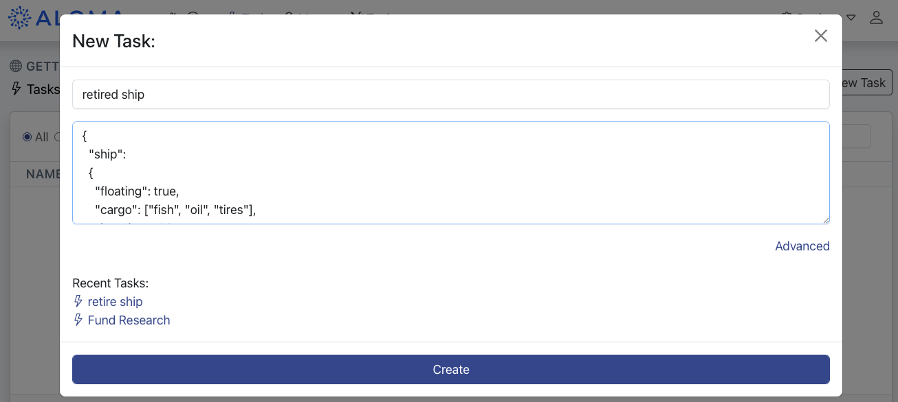
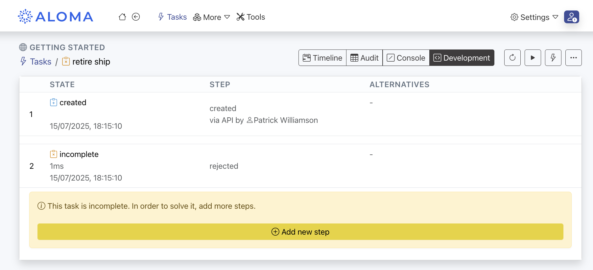
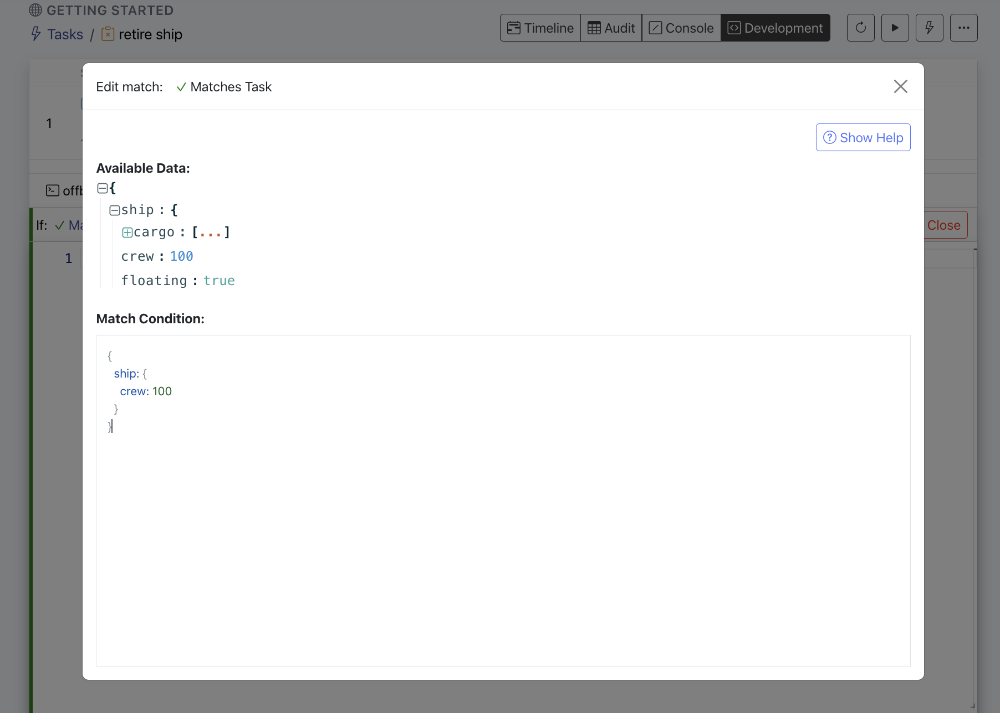
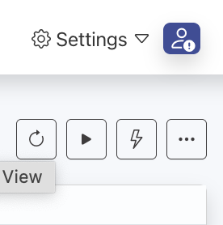
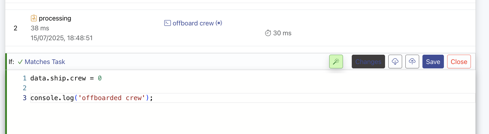
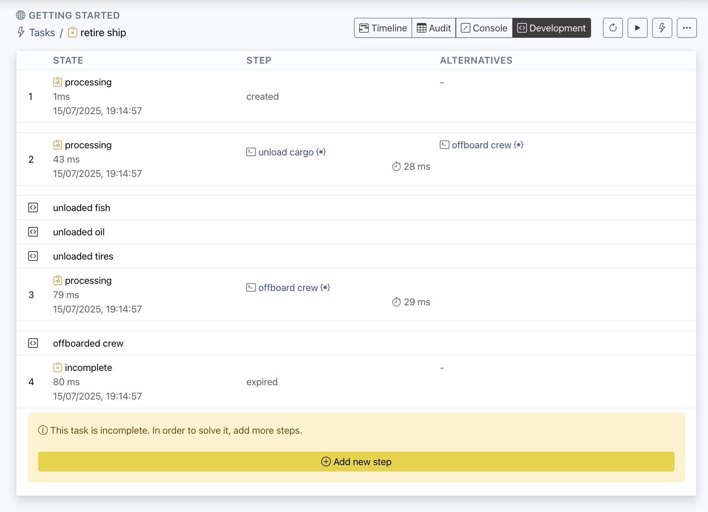
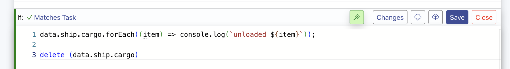
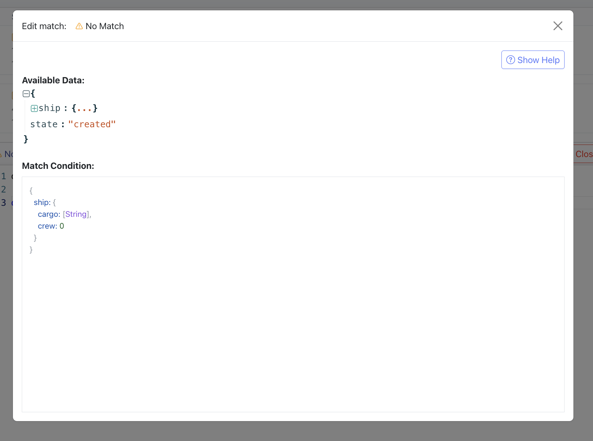
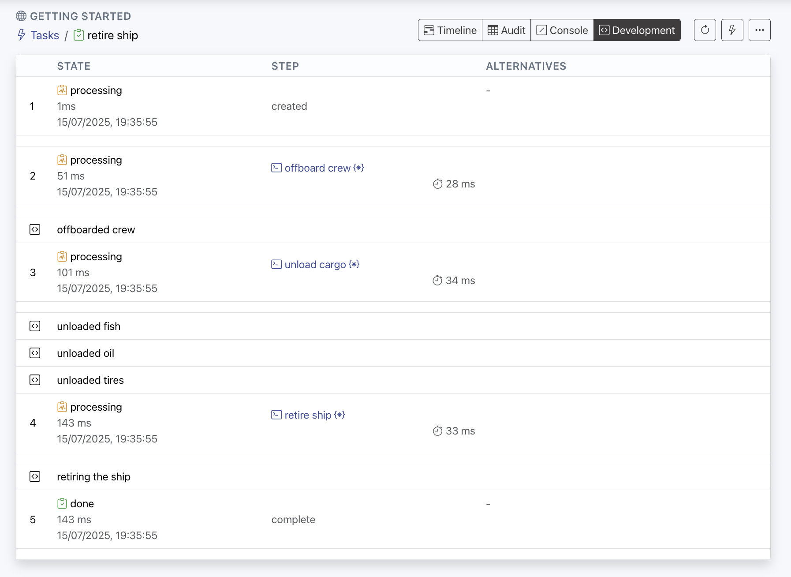

# ALOMA Toy Example

Build your first automation with ALOMA in under 10 minutes.

In this walkthrough, you'll create a simple multi-step workflow to simulate retiring a ship — complete with conditional execution, state changes, and an optional email notification. You'll learn how to define tasks, write matching logic, and deploy code in real time.

---

## Table of Contents

- [Pre-requisites](#pre-requisites)
- [The Story](#the-story)
- [Video Tutorial](#video-tutorial)
- [Before You Begin](#before-you-begin)
- [Creating the Task](#creating-the-task)
- [Building the Workflow](#building-the-workflow)
  - [Step 1: Offboard Crew](#step-1-offboard-crew)
  - [Step 2: Unload Cargo](#step-2-unload-cargo)
  - [Step 3: Retire Ship](#step-3-retire-ship)
- [Instant Deployment and Testing](#instant-deployment-and-testing)
- [Bonus: Sending Notifications via Email](#bonus-sending-notifications-via-email)
- [What You Learned](#what-you-learned)

---

## Pre-requisites

- A registered account at [ALOMA](https://home.aloma.io)

## The Story

The toy automation simulates a simple real-world process: **retiring a ship**.

Business rules:

- Instructions must be carried out individually
- The ship can only be retired *after* both cargo and crew are offboarded

## Video Tutorial

**Watch the full walkthrough before proceeding.** *(Embed or link to video tutorial here)*

---

## Before You Begin

1. [Login to ALOMA](https://home.aloma.io)
2. Enter the **Getting Started** workspace


---

## Creating the Task

1. Go to the **Task** tab  
   

2. Click `New Task`  
   

3. Name it `retire ship`  
4. Paste in the following JSON and hit `Create`:

```json
{
  "ship": {
    "floating": true,
    "cargo": ["fish", "oil", "tires"],
    "length": "100m",
    "crew": 100
  }
}
```



> In production, tasks usually come from other systems (e.g. Webhooks). We're using the UI for simplicity.

---

## Building the Workflow

### Step 1: Offboard Crew

1. Click `Add New Step`



2. Name the step `offboard crew`  
   

3. Set the Match Condition:

```js
{
  ship: {
    crew: 100
  }
}
```



4. Add the code:

```js
data.ship.crew = 0;
console.log('offboarded crew');
```


5. Click **Save**, then press the lightning bolt icon  
   

6. Confirm execution:  
     
     
   

---

### Step 2: Unload Cargo

1. Add a new step: `unload cargo`

2. Match Condition:

```js
{
  ship: {
    cargo: [String]
  }
}
```

3. Code:

```js
data.ship.cargo.forEach((item) => console.log(`unloaded ${item}`));
delete(data.ship.cargo);
```

4. Re-run using lightning bolt  
   

5. Result:  
   

6. To ensure crew is offboarded first, update match condition:

```js
{
  ship: {
    cargo: [String],
    crew: 0
  }
}
```

  


7. If no match:  
   

8. Re-run task:  
   

---

### Step 3: Retire Ship

1. Add a step: `retire ship`

2. Match Condition:

```js
{
  ship: {
    crew: 0,
    cargo: null
  }
}
```

3. Code:

```js
console.log('retiring the ship');
delete(data.ship);
```

Re-run the task and confirm all steps execute in order.

---

## Instant Deployment and Testing

- Click the lightning bolt to re-trigger using same data
- Logs and data diffs update instantly
- Code changes are live as soon as you hit **Save**

To mark task as complete:

```js
task.complete();
```

Create a new task and confirm:  


---

## Bonus: Sending Notifications via Email

1. Go to **Settings → Integrations**

2. Under **Connectors**, add `Email (SMTP - OAuth)`

3. Connect and authorize

4. In the `retire ship` step, add before `task.complete()`:

```js
connectors.eMailSmtpOAuth.send({
  from: "youremail@company.com",
  to: "joe.bloggs@company.com",
  subject: 'Ship has been retired',
  html: `
    <p>Dear Joe,</p>
    <p>The ship that arrived today has been retired!</p>
    <p>Kind Regards,<br>Aloma team</p>
  `
});
```

Run the task again. A notification will be sent by email.

---

## What You Learned

- Create and trigger a task in ALOMA  
- Define matching conditions and step logic  
- Deploy and test instantly  
- Control step order using data dependencies  
- Extend workflows with external integrations

---

[Next: Build your first real-time integration ›](../connectors/README.md)
