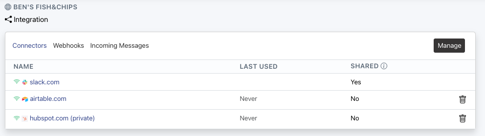

# Integration

For automating processes you need to integrate aloma with other systems.

__Example: Sync data from jira (inbound) to hubspot (outbound).__


1. Add a jira and hubspot connector to a workspace.
1. Connect jira via one click OAuth.
1. Connect hubspot via API Token.
1. For receiving events from jira, create a webhook in aloma in configure in [jira](https://developer.atlassian.com/server/jira/platform/webhooks/).
1. Done. Use the connectors to read/write data from both systems.


## Webhooks  

[Webhooks](https://en.wikipedia.org/wiki/Webhook) are an easy means to get data into or out of aloma.


## Incoming webhooks

Incoming webhooks create tasks in aloma. In the integration configuration one can simply add new hooks as desired:


These can then be used in a foreign system.

As an example, here is what a curl call looks like to create a task via webhook:

```shell
curl -v -X POST -H'Content-type: application/json' --data-binary '{"a": "hello", "b": "world"}' 'https://connect.aloma.io/event/$webhookId'
```

## Outgoing webhooks

Outgoing webhooks can be used by making a [fetch](https://developer.mozilla.org/en-US/docs/Web/API/Fetch_API) request to them. 

If you need access tokens, these can be configured in the workspace configuration:


In a step:

```js
const result = await connectors.fetch({ 
  url: 'https://example.com/webhook', 
  options: { 
    method: 'POST', 
    body: JSON.stringify({"hello": "world"}), 
    headers: { 
      'Content-type': 'application/json',
      'Authorization': `Bearer ${task.config('WEBHOOK_SECRET')}`
    } 
  } 
});
```

## Connectors

Connectors are useful for any kind of complex integration. The aloma connectors and SDK support a wide range of easy configuration like [API Keys](https://en.wikipedia.org/wiki/API_key), [OAuth](https://en.wikipedia.org/wiki/OAuth), ...


### Manage Connectors

One can manage the connectors of a workspace and add/remove connectors.



You will see a list of available connectors.


If you add a connector to a workspace and the connector needs configuration, you can see that in the connector list:


Just navigate to the connector to configure it. 

API Key (Example):


OAuth (Example):


Username/Password (Example):


Cloud connectors can simply be added to the workspace and run inside of aloma.
On-premise connectors need to be added to the workspace and can then be run on-premise. The registration key is needed to connect said connector to your workspace.

### Developing Connectors

:::note
Take a look at a [connector example](https://github.com/aloma-io/integration/tree/main/nodejs/examples/hello-world) or our [sql connector](https://github.com/aloma-io/connector-sql/).
:::

<br />
1. Register your connector (after creation navigate to my connectors and take note of the connector ID, e.g. 1234)

1. Create a new connector with our [SDK](https://github.com/aloma-io/integration) by running <br /> `npx @aloma.io/integration-sdk@latest create my-connector --connector-id 1234`
1. Add the connector to a workspace.
1. Start the connector by running `yarn build; yarn start`.
1. Once up, configure as necessary.
