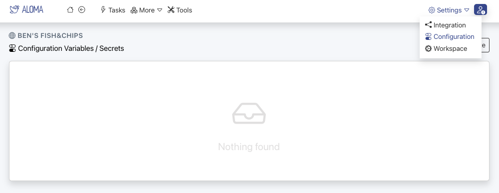

# Integration

For automating processes you need to integrate aloma with other systems.

__Example: Sync data from jira (inbound) to hubspot (outbound).__


1. Add a jira and hubspot connector to a workspace.
2. Connect jira via one click OAuth.
3. Connect hubspot via API Token.
4. For receiving events from jira, create a webhook in aloma in configure in [jira](https://developer.atlassian.com/server/jira/platform/webhooks/).
5. Done. Use the connectors to read/write data from both systems.

---

## Webhooks  

[Webhooks](https://en.wikipedia.org/wiki/Webhook) are an easy means to get data into or out of aloma.

### Incoming webhooks

Incoming webhooks create tasks in aloma. In the integration configuration one can simply add new hooks as desired.

**Using the CLI**


**Using the Web UI**

First, in your workspace navigate to the integration menu.


Then select the webhooks tab 


Then add a webhook by giving it a names and clicking create.


Clicking on the webhook copies it to the clipboard. These can then be used in the external system.

As an example, here is what a curl call looks like to create a task via webhook:

```shell
curl -v -X POST -H'Content-type: application/json' --data-binary '{"a": "hello", "b": "world"}' 'https://connect.aloma.io/event/$webhookId'
```

## Outgoing webhooks

**Using the CLI**


**Using the Web UI**

Outgoing webhooks can be used by making a [fetch](https://developer.mozilla.org/en-US/docs/Web/API/Fetch_API) request to them. 

If you need access tokens, these can be configured in the workspace configuration accessible here:

 

Simply enter you secret 


and it will be accessible in the workspace by referring to it as a variable

```bash
task.config("MySecondSecret");
```

In a step:

```js
const result = await connectors.fetch({ 
  url: 'https://example.com/webhook', 
  options: { 
    method: 'POST', 
    body: JSON.stringify({"hello": "world"}), 
    headers: { 
      'Content-type': 'application/json',
      'Authorization': `Bearer ${task.config('MySecondSecret')}`
    } 
  } 
});
```

## Connectors

Connectors are useful for any kind of complex integration. The aloma connectors and SDK support a wide range of easy configuration like [API Keys](https://en.wikipedia.org/wiki/API_key), [OAuth](https://en.wikipedia.org/wiki/OAuth), ...

Connectors are managed in a Workspace and need to be setup in each individual workspace.

### Manage Connectors

**Using the CLI**


**Using the Web UI**

Navigate to the integration menu.


This provides you a list of installed connectors. By clicking on the manage button you can add connectors.


You will see a list of available connectors, and can add them by clicking on the "add" button. On prem and cloud connectors are shown on the list and differentiated by their icons. You can also create on prem "local" connectors by clicking on the "create" button. This is done using the [SDK](https://github.com/aloma-io/connectors)


If you add a connector to a workspace and the connector needs configuration - generally to add access credentials, you can see that in the connector list:


Just navigate to the connector in the list of installed connectors to configure it. 

To add an API Key:


To authourise via OAuth (this will open the oauth permissions window):


Username/Password (these are set as secrets in the UI):


Cloud connectors can simply be added to the workspace and run inside of aloma.
On-premise connectors need to be added to the workspace and can then be run on-premise. The registration key is needed to connect said connector to your workspace.

### Developing Connectors

:::note
Take a look at a [connector example](https://github.com/aloma-io/integration/tree/main/nodejs/examples/hello-world) or our [sql connector](https://github.com/aloma-io/connector-sql/).
:::

<br />
1. Register your connector (after creation navigate to my connectors and take note of the connector ID, e.g. 1234)

2. Create a new connector with our [SDK](https://github.com/aloma-io/integration) by running <br /> `npx @aloma.io/integration-sdk@latest create my-connector --connector-id 1234`
3. Add the connector to a workspace.
4. Start the connector by running `yarn build; yarn start`.
5. Once up, configure as necessary.
