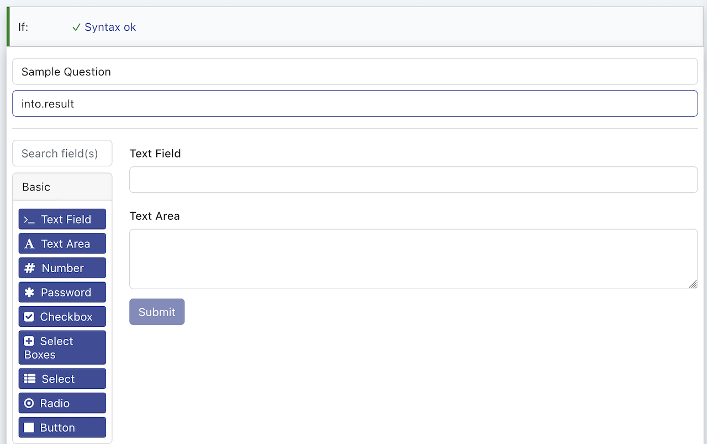

# Steps

## Overview

A step consists of a `match` and `code`. The match specifies in which state of the task the step may be applied. The code specifies what to execute if applied.

**Open the outline view for easier navigation**

### Match

Given a task, a match can match any subset of the data of the task. One can match for type or for value. One should exactly match the data that is needed for the do part, not more and not less.

* Use JSON format to define match conditions
* Match against specific fields using dot notation (e.g. contact.name)
* Use operators like $eq, $ne, $gt, $lt, $in, $nin
* Combine conditions with $and, $or, $not

```js
{
  user:
  {
    id: null           // id is null
    firstName: String, // type match, read as "firstName is a String"
    lastName: "Doe",   // exact value match, read as "lastName is Doe"
    age: 21,           // Number for type match
    alive: true        // Boolean for type match,
    parents: Array     // type match
    children: [{name: String, age: Number}] // the array must contain at least one object where obj.name is a String and age is a Number
    cars: Object       // type match, cars is an Object ({})
    house:             // subtree match
    {
      street: String
    }
  }
}

// Match contacts with specific name
{
  "contact.name": "John Doe"
}

// Match contacts with age > 25
{
  "contact.age": { "$gt": 25 }
}

// Match contacts from specific countries
{
  "contact.country": { "$in": ["US", "UK", "CA"] }
}
```

### Code

Code is `javascript`, it can change the task data or interact with connectors. There are also some builtins.

```js
// get an set the name of a task
task.name(`${task.name()} new name`);

// change data
data.user.id = Math.random()
data.user.children.push({name: 'Peter', age: 42})

delete(data.house)

// send an email via a connector
const sent = await connectors.eMailSmtp.send
({
    from: 'hello@example.com',
    to: ['hello2@example.com', 'hello2@example.com'],
    subject: 'subject ' + data.user.firstName,
    html: `<p>Hello ${data.user.firstName}</p>`,
    attachments: [
        {name: 'some cool.pdf', content: `base64 ...`}
    ]
});

// for diagnosis
console.log('response', sent);

// change task data
data.emailSent = sent;
```

## Builtins

Step framework.

### Debugging

One can use `console.log` to debug a step in the task execution view.

```js
console.log('task data', data);
```

### Config

A workspace can have static configuration.

```js
let endpoint = task.config('SERVER_ENDPOINT');
```

These are set as Environment variables in the Workspace configuration.

### Graph

The task data can hold a graph. It can be matched on in steps.

```js
const ship  = graph.addVertex({ type: 'Ship' })
const port1 = graph.addVertex({ type: 'Port', name: 'New York' })
const port2 = graph.addVertex({ type: 'Port', name: 'Frankfurt' })

const edge1 = graph.connect({ out: ship.id, in: port.id, type: 'leaving' });
const edge2 = graph.connect({ out: ship.id, in: port2.id, type: 'sailsTo' });

task.visualize({
    name: 'graph',
    type: 'graph',
    data: graph.get()
})

graph.getVertex(ship.id);
graph.removeVertex(ship.id);
graph.removeEdge(edge1.id);

graph.vertices().filter((vertex) => vertex.name === 'New York')
graph.edges().filter((edge) => vertex.type === 'leaving')
```

Match on the graph:

```js
// The step applies if the graph does contain at least one vertex of type Ship
{
  $graph:
  {
    vertices: [{type: 'Ship'}]
  }
}
```

### Park

A task can be parked, meaning, it will not be processed until the task data is changed. For example when waiting for input from a user.

```js
// park the task for 24 hours
task.park(24 * 60 * 60 * 1000)
```

### Complete

A task can be explicitly completed. Can take an optional result.

```js
let taskResult = {a: 15}
task.complete(taskResult);
```

A task can be completed when it expires. Can take an optional result.

```js
let taskResult = {a: 15}
task.completeOnExpire(taskResult);
```

### Ignore

A task can be explicitly ignored.

```js
task.ignore();
```

### Redo

A step will not be run consecutively. In order to achieve that, one can redo the step. Make sure that you have a working ending condition, otherwise the step will be repeated indefinitely.

```js
if (data.items.length)
{
  const item = data.items.shift();
  // do something with item;

  // redo this step
  step.redo();
} else {
  console.log('nothing to process, not redoing')
}
```

### Data Mapping

Mapping data can be done with a mapper:

```js
const data = {
  ship:
  {
    floating: true,
    cargo: ["fish", "oil", "tires"],
    length: '100m',
    crew: 100
  }
};

const transform = mapper();

transform
  .map("ship.cargo").to("train.cargo")
  .map("ship.crew").to("train.passengers")
  
console.log(transform.execute(data));
```

[Learn more](https://github.com/midknight41/map-factory#getting-started).

### Visualize

In order to inspect data one can visualize it, it will be displayed in the task view:

```js
// visualize a chart
task.visualize({
  type: 'chart', name: 'chart', data: {
    a: {
        color: 'green',
        smooth: true,
        name: 'a',
        type: 'line',
        showSymbol: false,
        data: [[16660397116138, 22], [1666039016138, 3], [1666039116138, 16]],
    }, b: {
        color: 'red',
        smooth: true,
        name: 'b',
        type: 'line',
        showSymbol: false,
        data: [[16660397116138, 2], [1666039016138, 4], [1666039116138, 6]],
    }} 
});

// visualize generic data as a tree
task.visualize({ type: 'data', name: 'data', data });

// visualize generic as a scrollable map
task.visualize({ type: 'data-map', name: 'data-map', data });

// visualize a graph
task.visualize({
    name: 'graph',
    type: 'graph',
    data: graph.get()
})

// visualize tabular data
task.visualize({
    type: 'table',
    name: 'table1',
    data: [
        {
            "vendorID": 8058,
            "materialID": 520005,
            "preference": 1,
            "stockAvailable": 20
        },
        {
            "vendorID": 8054,
            "materialID": 520005,
            "preference": 2,
            "stockAvailable": 20
        }
    ],
    options: {
        headers: {
            "vendorID": "Vendor ID",
            "materialID": "Material ID",
            "preference": "Preference",
            "stockAvailable": "Available Stock"
        }
    }
})
```

## Integration

### Connectors

A step can interface with deployed integrations in a workspace.

```js
connectors.$nameOfTheConnector.$method
({
    ... // $parameters
});
```

There are two ways to process the result.

1.) One can directly `await` the call (recommended)

```js
const sent = await connectors.eMailSmtp.send
({
    from: 'hello@example.com',
    to: ['hello2@example.com', 'hello2@example.com'],
    subject: 'subject ' + data.user.firstName,
    html: `<p>Hello ${data.user.firstName}</p>`,
    attachments: [
        {name: 'some cool.pdf', content: `base64 ...`}
    ]
});

console.log(sent)
```

2.) One can let the result be written into the task.

Every connector call supports the `into` parameter.

```js
data.some ||= {};
data.some.result ||= {};
data.some.result.key ||= {};

connectors.eMailSmtp.send
({
    ... // parameters,
    into: 'some.result.key'
});
```

### Fetch

A step can use fetch directly. As with integrations, the result can be awaited or put into the task when available.

```js
const results = await connectors.fetch({ url: 'https://example.com', bodyOnly: true });

// or
data.some ||= {};
data.some.result ||= {};

connectors.fetch({ url: 'https://example.com', bodyOnly: true, into: 'some.result' });
```

## Conversation

In order to aquire missing data, approval, ..., human interaction in general, one can have conversations in a step:

### Forms

Forms are useful for asking for structured data. Use the nocode form builder by creating a new step of type `Form`.



### Presentation

One can present data to a user, see `task.visualize` for more details.

```js
user.conversation({ kind: 'data', title: `Results`, name: `Results`, data: data })
```

## Audit

In order to highlight meaninful data from an audit or compliance perspective, on can use the audit facility. These are available in the task `Audit` view.

### Log

One can log a generic audit message.

```js
audit.log(`Ticket closed`)
```

### Reference

A reference is useful to highlight e.g. the external ticket number or a url. Normally a task is searchable in the ui by its name. Adding a reference enables to find a task by said reference.

```js
// audit a foreign id
audit.reference({id: 'INC46655', name: 'External Incident ID' /*, ...additional properties */})
audit.reference({id: 'U7868786', role: 'customer' /*, ...additional properties */})

// audit a url
audit.reference({id: 'INC46655', name: 'External Incident URL', url: 'https://example.com/INC46655' /*, ...additional properties */})
audit.reference({id: 'U7868786', role: 'customer', url: 'https://example.com/U7868786' /*, ...additional properties */})
```

### Working with the log

The audit log of the whole task is available:

```js
// preparing the audit log as text for attaching to a ticket resolution
const text = audit.get().map((what) => what.msg).join("\n")

// iterating through the log
audit.get().forEach((what) => console.log(what))

// find the customer
audit.get().find((what) => what.role === 'customer')
```
