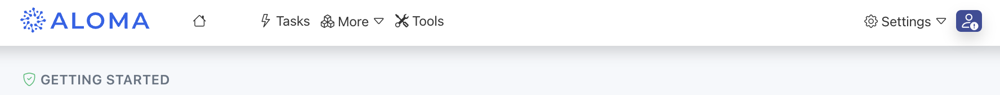

# Toy Example

Aloma in 10 Minutes.

## Pre-requisites

Account created in [ALOMA](https://home.aloma.io)

## The Story

The toy task we want to solve is `Retire a ship`. 

Like any real world process, it has certain steps and rules:

* All instructions must be carried out individually
* The ship can be retired only after the cargo and crew have been offboarded

## Video Tutorial

Watch this first!


## Before you begin

[Login](https://home.aloma.io) and enter the Getting Started workspace. 


## Creating the Task

Click on the Task menu item to change to the Task screen



A task is any valid `JSON` data, e.g.: 

```json title="Our toy task for ship retirement"
{
  "ship":
  {
    "floating": true,
    "cargo": ["fish", "oil", "tires"],
    "length": "100m",
    "crew": 100
  }
}
```
---

**In your aloma workspace click `new task`**


**name the task `retire ship`, paste the json and hit `create`.**


> **Note:** Normally you integrate aloma with other systems to obtain tasks, the easiest way being with a Webhook. We used the UI to create an example task for simplicity.


## Building the Workflow

Once you create a new task, you will be redirected to the task execution screen. We have not created any steps yet, so there is nothing to match and ALOMA reports "Task is incomplete" and add new step to start building the workflow. In ALOMA we build workflows based on data in context, we create a task from JSON and then write steps iteratively using real data, which makes it easier to build steps.


## Offboarding the Crew

Click on the "Add New Step" button to continue, which launches the create new step pop-up. 

Enter the Step Name `offboard crew`. Hit `create`.


**The step consists of two parts, a `match` and the `code` to apply. Copy the parts over to the step.**


**Click on `match invalid` and paste the match:**

```js title="match - offboard crew"
{
  ship: {
    crew: 100
  }
}
```


> **Note:** This step only offboards the **crew**, we are adding steps one-by-one to complete the task assuming they are being done one-by-one in real time. 

** Copy the following code into the step and save the step:**

```js title="code - offboard crew" showLineNumbers
data.ship.crew = 0

console.log('offboarded crew');
```


 Now save the step by clicking on the Save button in the upper right corner of the step. It is not deployed and available for use.

**Click on the lightning bolt to create a new task using the same data. There is no need to create a new task or trigger one externally, it just creates a new task using the same data.**


**It will open to the task execution, you can see the new step has executed and console log of offboarded crew**. 


**If we click on the step name "offboard crew" it opens up and we can see the code.**


**If we click on the change button, we can see the data before and after code execution**


---

## Unloading the Cargo

Now that we have added the first step and seen how the basics work, let's proceed to add additional steps to build out the workflow.

Click on the `Add New Step` buttong again. Name it `unload cargo`. Hit `create`.

* Click on `Match Invalid` and copy and paste the following matching condition:

```js title="match - unload cargo"
{
  ship: {
    cargo:[String]
  }
}
```

> **Note:** As before, this step claims only processes the **cargo** of the ship.

* Copy the following code into the step and save the step:

```js title="code - unload cargo" showLineNumbers
data.ship.cargo.forEach((item) => console.log(`unloaded ${item}`));

delete(data.ship.cargo)
```
Create a new task with the same starting data again.


**Note in our case ALOMA detected that both step conditions matched the task data and it chose to run the new one first. The order the steps run in are not consequential, so this is perfectly acceptable. You can also open each step and see how the data has changed**


**Perhaps we want the crew to offboard before the cargo is unloaded. Let's change the match condition of the `unload cargo` step to make this happen. Open the `unload cargo` step.**


**Click on `Matches Task` and change the conditions to the following:**
```js title="match - unload cargo"
{
  ship: {
    cargo:[String],
  crew: 0
  }
}
```


**As there is no longer a match with the task data, `Matches Task` has changed to `No Match`.**


**Rerun the task and it has now run in the correct order as the conditions have determined the order the steps run in.**


Now have a look at the data and you will see it has changed in the opposite order but the end result is the same. 

## Retiring the ship

Now add the third step, `retire ship`, using the data below:

```js title="match - retire ship"
{
  ship: {
    crew: 0,
    cargo: null
  }
}
```

* Copy the following code into the step and save the step:

```js title="code - retire ship" showLineNumbers
console.log('retiring the ship');

delete(data.ship);
```

This step will only run last based on the matching conditions. 

Now create a new task with same data and see that all 3 steps are executed and the ship is retired. 

## INSTANT DEPLOYMENT and TESTING

You can play around with the conditions and add new code or steps if you want. Every time you press save the code is available for immediate execution and you can see the results right away. This is building automations through iteration.

When you are finished, add the line 
```js title="Make Task Complete" showLineNumbers
task.complete()
```

<br />

> **Success:** Create a new task from the last one and see that all steps are applied and the task is marked as done.
>
> 

# Bonus - adding Slack

Let's post to Slack to let the team know that the ship is retired.

First got to the settings menu and select `integration`.


You are on the Connectors tab, beside it is the Webhook tab where you can create a Webhook. Now navigate down the list of available connectors and find `Email (SMTP - OAuth)` and select `Add`.


In the list of added connectors, Email will have a red symbol next to it indicating it needs to be connected. Click Connect and grant OAuth access.


Now go back to the last task you ran and select the final step, in our case `retire ship`.


Add the following code just before the `task complete()`
```js title="code - send email" showLineNumbers
connectors.eMailSmtpOAuth.send({
  from: "youremail@company.com",
  to: "joe.bloggs@company.com",
  subject: 'Ship has been retired',
  html: `
  <p>Dear Joe,</p>

  <p>The ship arrived today has been retired!</p>

  <p> Kind Regards, <br>
  Aloma team </p>
  `
});```

Save and create a new task again with the lightning bolt and VOILA! Email added and sent.
