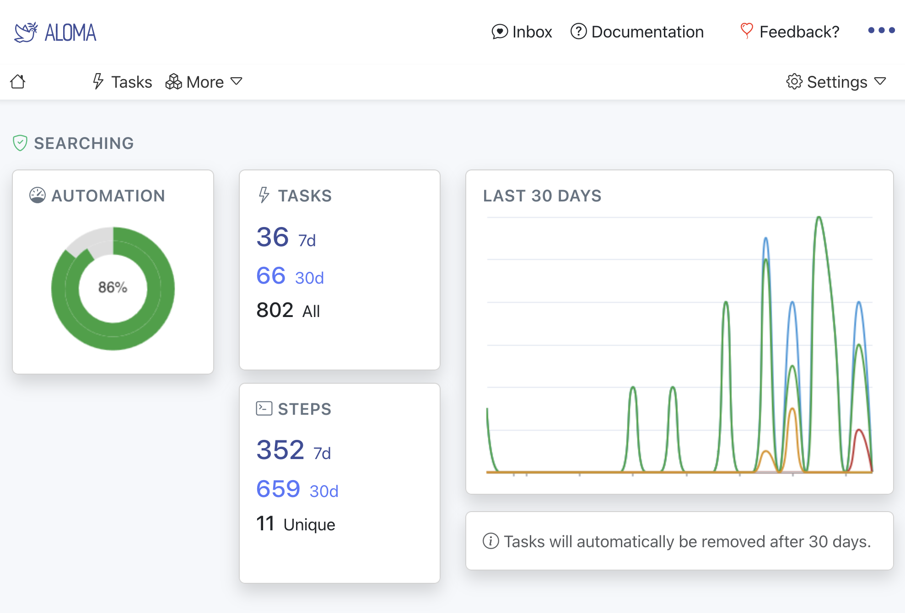
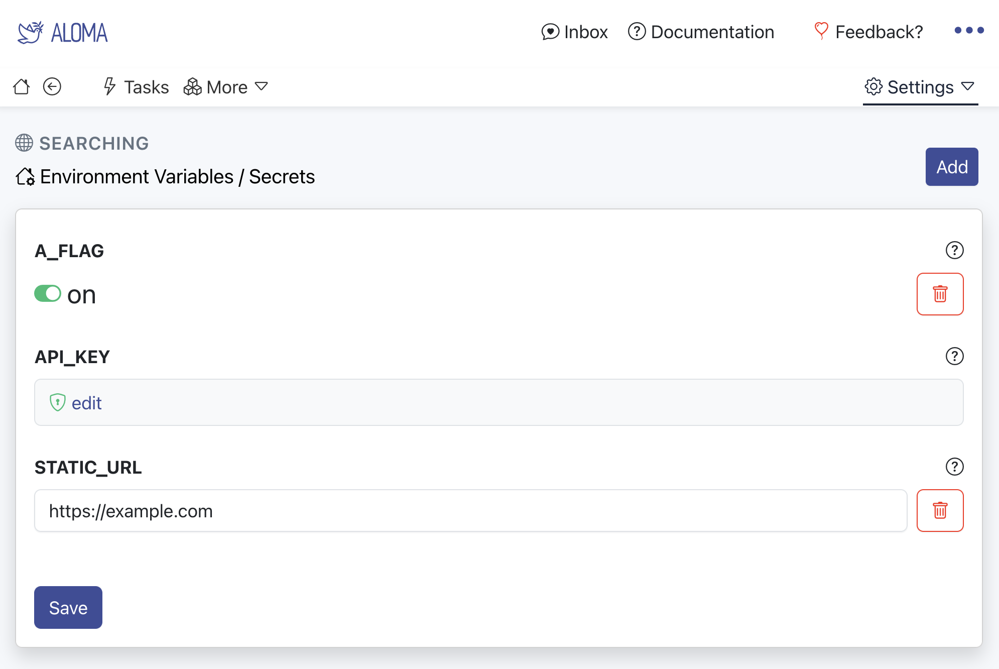
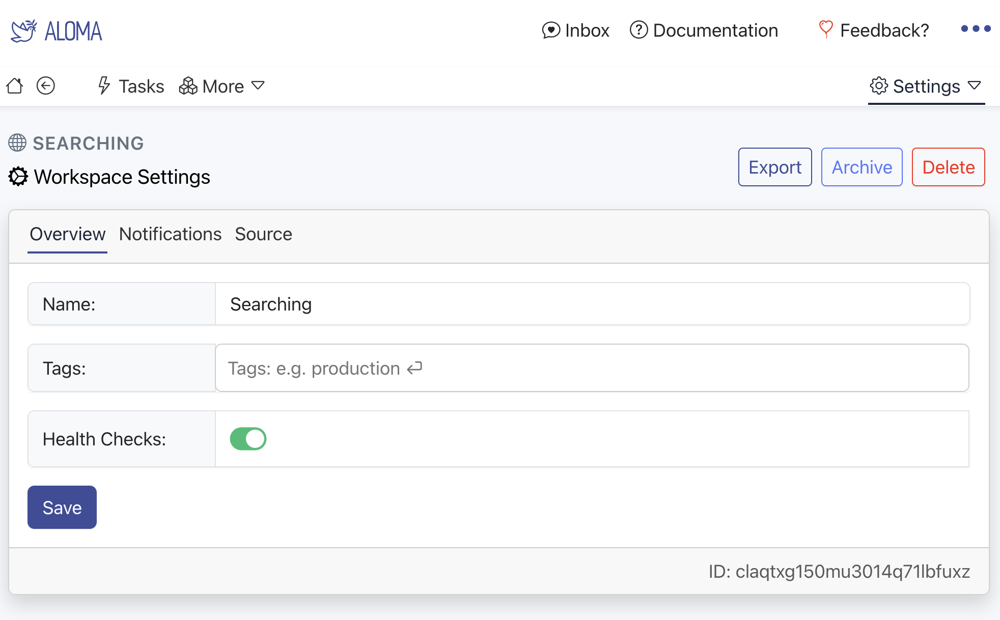
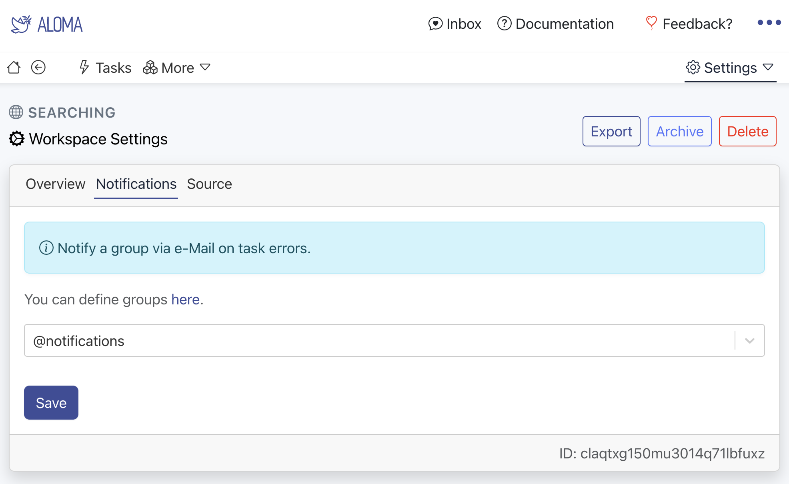
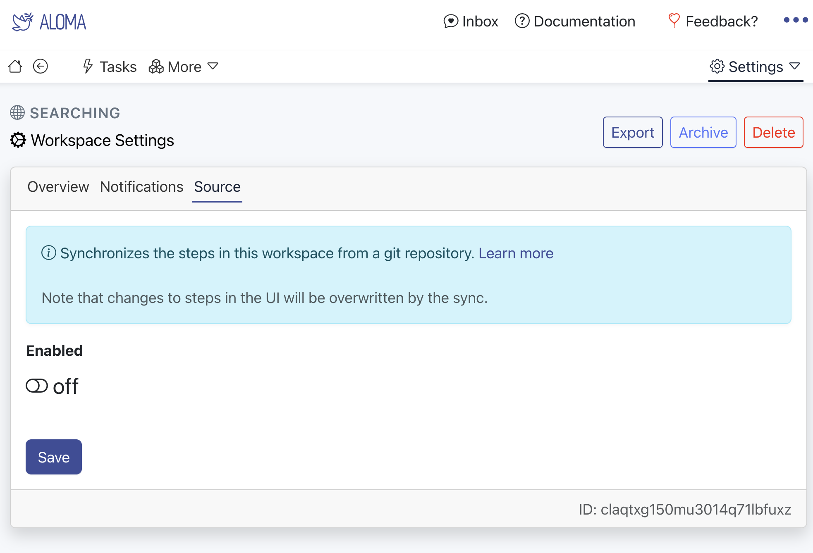
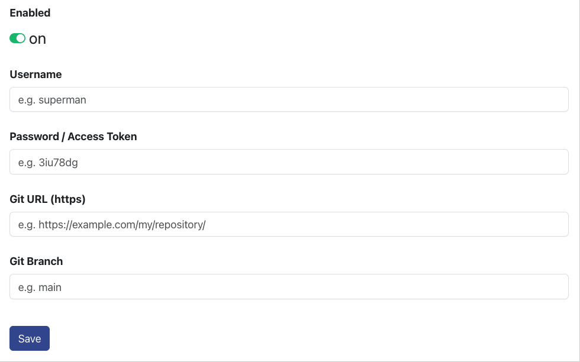

# Workspaces

Workspaces serve as environments to separate resources like tasks, steps, connectors, ...

## Creating a workspace

A workspace can be created with the 'New Workspace' button on the <a href="https://home.aloma.io/" target="_blank">home page</a>.
After entering a name, giving it optional tags for filtering and creating it, the workspace is ready to use.


## Overview

The overview of a workspace holds the automation rate and task metrics.



## Configuration

A workspace can be configured.

### Integrations

See [Integrations](https://github.com/aloma-io/aloma-io/blob/main/docs/getting-started/integration)).

### Environment

The environment can hold static configuration values. These can be referenced in a task via `task.config('API_KEY')`.



### Settings

Name, tags, as well as health checks can be configured in the overview. Health checks give an indicator about unused steps, connectors or webhooks.



### Notifications

Notifications can be configured to receive notifications via e-Mail about errors in tasks. E-Mails will not be sent immediately when a task fails, but in an interval like 15 - 30 minutes.



### Source

Steps can be synchronized from git into a workspace or vice versa.



In order to get started, use the [workspace-sdk](https://github.com/aloma-io/integration/tree/main/workspace-sdk) to create a new project.

```shell
npx @aloma.io/workspace-sdk@latest create projectName
```

Edit steps in the repositry, then run

```shell
yarn build
```

Afterwards import into a git repository.

Then enable the source sync in the aloma workspace and provide the necessary info like username, password, git https:// url (git:// urls are not supported).



The workspace will then synchronize steps from the git repository. 
Note that, steps, which do not exist in the git repository, will be deleted. Steps that have been modified in the aloma ui will be overwritten by the steps in the git repository.

### Developing

One can create two workspaces, dev and prod synchronizing against one git repository. Then configure source sync in prod to automatic and in dev to be manual.

In the dev workspace, set automatic to off (otherwise changes will be overwritten by the sync). Then start writing/changing steps in the dev workspace.

Then create an [aloma api key](https://home.aloma.io/api) at  and export it into the shell:

```shell
export ALOMA_KEY="54321"
```

To deploy to the prod workspace, pull the changes from the dev workspace into the git repository:

```shell
npx @aloma.io/workspace-sdk@latest pull 12345
```
(The workspace id can be found in `aloma` &raquo; `Settings` &raquo; `Workspace`).

Then one can use the standard git/pull-request/merge-request workflow to transfer into the branch for the prod workspace.

One can also create a `.aloma.yaml` file in the git repository with the following contents:

```yaml
pull:
  workspaces:
    # one or more source workspace ids
    - 12345
```

and then just use:

```shell
npx @aloma.io/workspace-sdk@latest pull
```

to sychronize.
