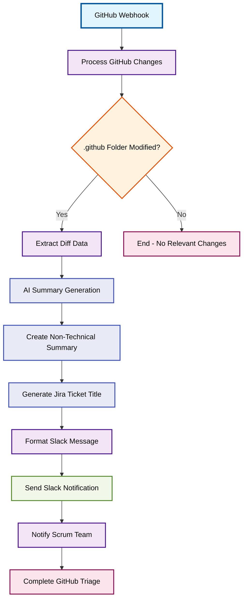

# Demo Scenario 1: Zero-friction GitHub Triage

## Workflow Overview
Automatically monitors GitHub repository changes, uses AI to create non-technical summaries of commits affecting the .github folder, and notifies the scrum team via Slack with actionable Jira ticket suggestions.

## Process Flow

## Steps Involved

1. **GitHub Webhook** - Receives repository change notifications
2. **Process GitHub Changes** - Analyzes commit data for relevant modifications
3. **AI Summary Generation** - Uses Perplexity AI to create non-technical summaries
4. **Slack Notification** - Alerts scrum team with Jira ticket recommendations

## Key Features

- **Smart Filtering**: Only processes changes to .github folder
- **AI-Powered Analysis**: Converts technical diffs into business-friendly summaries
- **Automated Triage**: Suggests Jira ticket titles and descriptions
- **Team Integration**: Direct Slack notifications to development team

## Prerequisites

- GitHub webhook configured
- Perplexity AI connector
- Slack workspace access
- Designated scrum team channel
