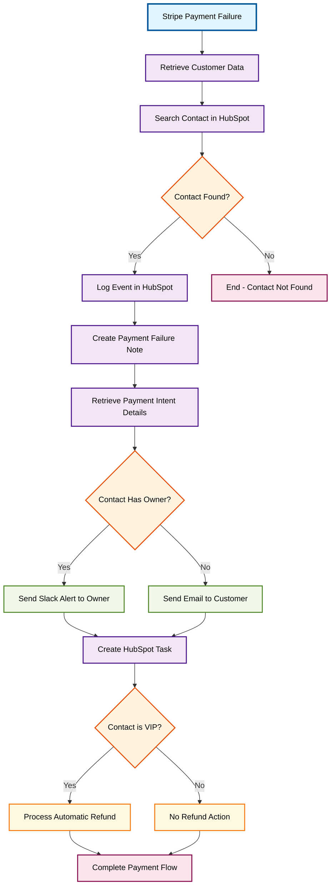

# Demo Scenario 2: Stripe Payment Failure Management

## Workflow Overview
Handles Stripe payment failures by automatically looking up customers in HubSpot, logging the failure, notifying appropriate parties (owner or customer), creating follow-up tasks, and processing automatic refunds for VIP customers.

## Process Flow

## Steps Involved

1. **Stripe Payment Failure** - Webhook triggers on payment failure events
2. **Customer Lookup** - Retrieves customer data from Stripe and searches HubSpot
3. **Event Logging** - Creates detailed notes in HubSpot with failure information
4. **Smart Notifications** - Routes alerts to contact owner (Slack) or customer (Email)
5. **Task Management** - Creates high-priority follow-up tasks for support team
6. **VIP Processing** - Automatically processes refunds for VIP customers

## Key Features

- **Intelligent Routing**: Owner-based vs customer notification logic
- **VIP Customer Handling**: Automatic refund processing for premium customers
- **Comprehensive Logging**: Detailed payment failure documentation in HubSpot
- **Multi-Channel Alerts**: Slack for internal team, Email for customers
- **Task Automation**: Automatic support task creation with priority levels

## Prerequisites

- Stripe webhook integration
- HubSpot CRM with VIP status field
- Slack workspace for team notifications
- Email service (SMTP OAuth)
- Custom HubSpot properties configured
