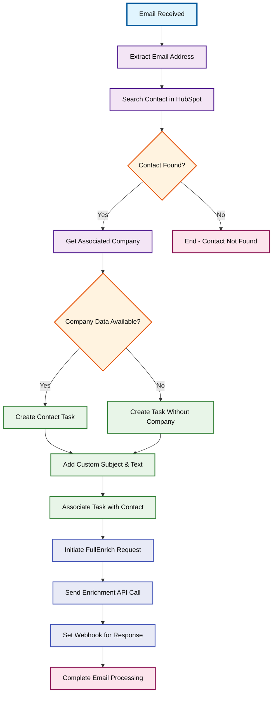

# Demo Scenario 3: Email-triggered Contact Enrichment

## Workflow Overview
Processes incoming emails by extracting sender information, finding contacts in HubSpot, retrieving associated company data, creating follow-up tasks, and triggering advanced data enrichment through FullEnrich API integration.

## Process Flow

## Steps Involved

1. **Email Processing** - Extracts sender email address from incoming messages
2. **Contact Search** - Looks up contact in HubSpot using email address
3. **Company Association** - Retrieves associated company data if available
4. **Task Creation** - Creates personalized tasks with custom subject and content
5. **Data Enrichment** - Initiates FullEnrich API request for additional contact data

## Key Features

- **Email Trigger Integration**: Automatic processing of incoming emails
- **HubSpot Integration**: Seamless contact and company lookup
- **Dynamic Task Creation**: Custom tasks based on available data
- **Advanced Enrichment**: FullEnrich API integration for comprehensive data
- **Webhook Response**: Configured for asynchronous enrichment results

## Prerequisites

- Email service integration
- HubSpot CRM access
- FullEnrich API account and webhook endpoint
- Custom task fields in HubSpot
- Email parsing capabilities
