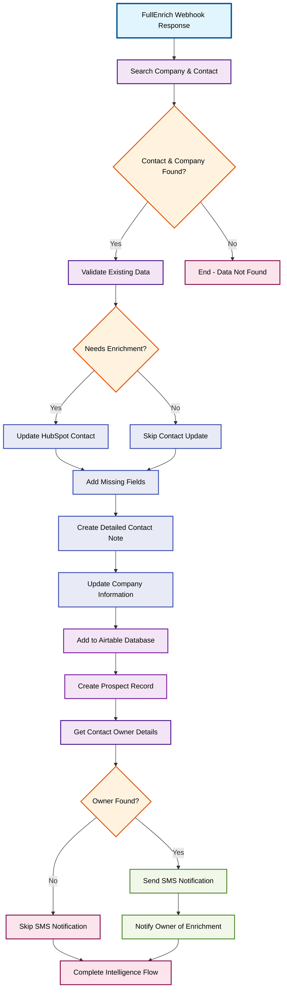

# Demo Scenario 4: Advanced Contact Intelligence & Notification System

## Workflow Overview
Processes FullEnrich webhook responses to intelligently update HubSpot contacts and companies with enriched data, logs information to Airtable for tracking, and notifies contact owners via SMS about successful enrichment completion.

## Process Flow

## Steps Involved

1. **FullEnrich Response** - Processes webhook data from FullEnrich API
2. **Data Validation** - Searches and validates contact/company information
3. **Intelligent Updates** - Only updates missing or empty fields in HubSpot
4. **Documentation** - Creates comprehensive contact notes with all enriched data
5. **Database Logging** - Adds prospect information to Airtable for tracking
6. **Owner Notification** - Sends SMS alerts to contact owners about enrichment completion

## Key Features

- **Smart Data Merging**: Only updates missing fields, preserves existing data
- **Comprehensive Notes**: Detailed contact profiles with social media, positions, and company info
- **Multi-System Sync**: Updates both HubSpot and Airtable simultaneously
- **Owner Communication**: SMS notifications to keep account managers informed
- **Data Validation**: Ensures data quality before processing updates

## Prerequisites

- FullEnrich webhook integration
- HubSpot CRM with custom enrichment fields
- Airtable database for prospect tracking
- Twilio SMS service
- Contact owner phone numbers in system
