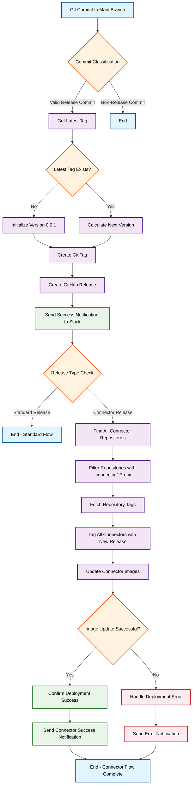

# GitHub Release Management CI/CD Automation Flowchart

This flowchart illustrates the complete automated release management process from commit to deployment with intelligent version management and team notifications.

## Workflow Description

### Main Release Flow
1. **Git Commit**: Developer commits to main branch
2. **Commit Classification**: System determines if commit should trigger a release
3. **Version Management**: Retrieves current version and calculates next semantic version
4. **Tag Creation**: Creates Git tag for the new version
5. **Release Publishing**: Publishes GitHub release with auto-generated notes
6. **Notifications**: Sends success notification to Slack channel

### Connector Release Flow
For repositories identified as connectors:
1. **Repository Discovery**: Finds all repositories with "connector-" prefix
2. **Bulk Processing**: Tags all connector repositories with new version
3. **Image Deployment**: Updates connector images in infrastructure
4. **Deployment Verification**: Confirms successful deployment
5. **Final Notifications**: Sends completion status to team

## Key Features

- **Automated Versioning**: Semantic version calculation with patch increment
- **Smart Tagging**: Git tag creation with custom prefixes for specific repos
- **Bulk Releases**: Simultaneous release of multiple connector repositories  
- **Deployment Automation**: Connector image updates with confirmation
- **Team Notifications**: Slack integration for success/failure alerts
- **Smart Filtering**: Excludes specific repositories from automatic releases

## Prerequisites

- ALOMA CLI installed
- GitHub repository admin rights
- Slack workspace access
- Proper webhook configuration

## Usage

This flowchart can be embedded in your GitHub README or documentation. The Mermaid syntax will render automatically on GitHub, providing an interactive visual guide to your CI/CD process.

To customize the workflow, modify the trigger conditions and repository filters as described in the full documentation.
