# HubSpot to Xero Invoice Automation Flowchart

This flowchart illustrates the automated process for converting HubSpot deals into Xero invoices with complete data validation and team notifications.

```mermaid
flowchart TD
    A[HubSpot Deal Stage Change] --> B[Fetch Deal Data]
    B --> C{Deal Data Retrieved?}
    C -->|Yes| D[Retrieve Associated Data]
    C -->|No| E[Create Error Subtask]
    
    D --> F[Get Companies & Contacts]
    F --> G[Get Line Items & Pricing]
    G --> H[Send Data Collection Notification]
    
    H --> I[Validate Deal Requirements]
    I --> J{Deal Valid?}
    J -->|Missing Data| K[Create Validation Error]
    J -->|Valid| L[Fix Currency Format]
    
    K --> M[Send Slack Error Alert]
    L --> N{Currency Corrected?}
    N -->|Yes| O[Set Validated Flag]
    N -->|No| P[Set Default Currency AUD]
    
    P --> O
    O --> Q[Create Xero Invoice Process]
    
    Q --> R{Contact Exists in Xero?}
    R -->|No| S[Create New Xero Contact]
    R -->|Yes| T[Use Existing Contact]
    
    S --> U[Build Invoice with Line Items]
    T --> U
    U --> V[Generate Invoice in Xero]
    V --> W[Retrieve Shareable Invoice URL]
    
    W --> X{Invoice Created Successfully?}
    X -->|No| Y[Handle Invoice Creation Error]
    X -->|Yes| Z[Set Invoice Created Flag]
    
    Y --> AA[Send Error Notification]
    Z --> BB[Add Invoice Link to HubSpot]
    
    BB --> CC[Update Deal Custom Fields]
    CC --> DD[Add Invoice URL & Number]
    DD --> EE{Fields Updated Successfully?}
    EE -->|No| FF[Create Update Error Subtask]
    EE -->|Yes| GG[Set Invoice Link Added Flag]
    
    FF --> HH[Send Update Error Alert]
    GG --> II[Move Deal to Invoiced Stage]
    
    II --> JJ[Update HubSpot Deal Stage]
    JJ --> KK{Stage Updated?}
    KK -->|No| LL[Handle Stage Update Error]
    KK -->|Yes| MM[Send Success Notifications]
    
    LL --> NN[Create Stage Error Subtask]
    MM --> OO[Send Slack Confirmation]
    OO --> PP[Send Email Confirmation]
    PP --> QQ[Mark Task Complete]
    
    %% Error handling paths
    E --> RR[End - Data Fetch Failed]
    M --> SS[End - Validation Failed]
    AA --> TT[End - Invoice Creation Failed]
    HH --> UU[End - Link Update Failed]
    NN --> VV[End - Stage Update Failed]
    
    %% Styling
    classDef startEnd fill:#e1f5fe,stroke:#01579b,stroke-width:2px,color:#000
    classDef process fill:#f3e5f5,stroke:#4a148c,stroke-width:2px,color:#000
    classDef decision fill:#fff3e0,stroke:#e65100,stroke-width:2px,color:#000
    classDef success fill:#e8f5e8,stroke:#2e7d32,stroke-width:2px,color:#000
    classDef error fill:#ffebee,stroke:#c62828,stroke-width:2px,color:#000
    classDef notification fill:#f1f8e9,stroke:#558b2f,stroke-width:2px,color:#000
    
    class A,QQ,RR,SS,TT,UU,VV startEnd
    class B,D,F,G,I,L,O,Q,S,T,U,V,W,Z,BB,CC,DD,GG,II,JJ,MM process
    class C,J,N,R,X,EE,KK decision
    class H,OO,PP success
    class E,K,Y,FF,LL,NN error
    class M,AA,HH notification
```

## Workflow Description

### Phase 1: Data Collection
1. **Deal Stage Monitoring**: System detects HubSpot deal stage changes
2. **Comprehensive Data Fetch**: Retrieves deal information, associated companies, contacts, and line items
3. **Data Packaging**: Consolidates all related information for processing
4. **Collection Confirmation**: Sends Slack notification confirming successful data retrieval

### Phase 2: Data Validation
1. **Requirement Check**: Validates deal has amount, company, contact, and line items with pricing
2. **Currency Normalization**: Fixes missing currency (defaults to AUD) or converts "Euro" to "EUR"
3. **Quality Control**: Ensures all required data is present before proceeding
4. **Error Handling**: Creates subtasks and alerts for any validation failures

### Phase 3: Invoice Creation
1. **Contact Management**: Checks if customer exists in Xero, creates new contact if needed
2. **Invoice Building**: Constructs complete invoice with all line items, quantities, and pricing
3. **Xero Generation**: Creates invoice in Xero accounting system
4. **URL Retrieval**: Gets shareable online invoice URL for easy access

### Phase 4: HubSpot Integration
1. **Field Updates**: Adds invoice URL and number to custom fields on HubSpot deal
2. **Visibility Enhancement**: Provides immediate access to invoice details within deal record
3. **Link Confirmation**: Verifies successful linking between systems
4. **Access Optimization**: Eliminates need to search through notes for invoice information

### Phase 5: Workflow Completion
1. **Stage Progression**: Moves HubSpot deal to "invoiced" stage
2. **Status Signaling**: Indicates to team that invoice processing is complete
3. **Multi-Channel Notifications**: Sends both Slack and email confirmations
4. **Process Finalization**: Marks automation workflow as successfully completed

## Key Features

- **Automated Data Collection**: Comprehensive retrieval of deal, company, contact, and line item data
- **Quality Validation**: Ensures all required information is present before processing
- **Smart Currency Handling**: Automatic currency format correction and defaults
- **Contact Management**: Creates Xero contacts automatically when needed
- **Bi-Directional Sync**: Updates both Xero and HubSpot systems
- **Error Recovery**: Comprehensive error handling with subtask creation
- **Team Notifications**: Multi-channel alerts for success and failure scenarios
- **Process Visibility**: Clear status tracking throughout the automation pipeline

## Prerequisites

- HubSpot account with deal management
- Xero accounting system access
- ALOMA automation platform
- Slack workspace for notifications
- Custom fields configured in HubSpot for invoice details

## Error Handling

The workflow includes comprehensive error handling at each stage:
- **Data fetch failures** create subtasks for manual review
- **Validation errors** trigger immediate Slack notifications
- **Invoice creation issues** generate detailed error reports
- **Field update problems** create recovery subtasks
- **Stage update failures** ensure no deals are lost in processing

## Usage

This flowchart can be embedded in your GitHub documentation to provide a clear visual guide to the HubSpot to Xero invoice automation process. The Mermaid syntax will render automatically on GitHub for easy reference and onboarding.
