# Waitlist Contact Processing and CTO Research Flowchart

This flowchart illustrates the automated process for handling new waitlist signups with intelligent CTO research and multi-channel contact management.

```mermaid
flowchart TD
    A[Webform Submission] --> B[Create HubSpot Contact Record]
    B --> C{Contact Created Successfully?}
    C -->|New Contact| D[Set HubSpot Create Flag]
    C -->|Duplicate Contact| E[Handle Existing Contact]
    
    E --> F[Set Contact Exists Flag]
    D --> G{Contact Job Title Check}
    F --> H[Add to Google Sheet]
    
    G -->|Job Title = CTO| I[Research CTO Profile and Background]
    G -->|Other Job Title| H[Add to Google Sheet]
    
    I --> J[Use AI to Analyze Professional Background]
    J --> K[Research LinkedIn, GitHub, Reddit Profiles]
    K --> L[Analyze Company Websites and Contributions]
    L --> M[Generate 50-Word Professional Summary]
    
    M --> N[Update HubSpot with Research Profile]
    N --> O[Add Research to Custom Field]
    O --> P{Research Profile Updated?}
    P -->|Yes| Q[Set Research Complete Flag]
    P -->|No| R[Handle Research Update Error]
    
    R --> S[Log Research Error]
    Q --> H[Add to Google Sheet]
    S --> H
    
    H --> T[Create New Row in Waitlist Spreadsheet]
    T --> U[Add Contact Details with Timestamp]
    U --> V[Include Name, Email, Company, Job Title]
    V --> W[Add Message and Research Profile]
    W --> X[Create Clickable HubSpot Record Link]
    
    X --> Y{Google Sheet Updated?}
    Y -->|Yes| Z[Set Google Added Flag]
    Y -->|No| AA[Handle Sheet Update Error]
    
    AA --> BB[Log Sheet Error]
    Z --> CC[Send Welcome Email]
    BB --> CC
    
    CC --> DD{Contact is CTO with Research?}
    DD -->|Yes| EE[Send Personalized Research-Based Email]
    DD -->|No| FF[Send Default Thank-You Email]
    
    EE --> GG[Include Custom Research Message]
    FF --> HH[Include Standard Welcome Content]
    
    GG --> II[Set Email Sent Flag]
    HH --> II
    II --> JJ[Send Slack Notification]
    
    JJ --> KK[Post to Designated Slack Channel]
    KK --> LL[Announce New Waitlist Signup]
    LL --> MM{Include Research Summary?}
    MM -->|CTO with Research| NN[Include Professional Background Summary]
    MM -->|Standard Contact| OO[Include Basic Contact Information]
    
    NN --> PP[Mark Task Complete]
    OO --> PP
    
    %% Error handling
    C -->|Creation Error| QQ[Handle Contact Creation Error]
    QQ --> RR[End - Contact Creation Failed]
    
    %% Styling
    classDef startEnd fill:#e1f5fe,stroke:#01579b,stroke-width:2px,color:#000
    classDef process fill:#f3e5f5,stroke:#4a148c,stroke-width:2px,color:#000
    classDef decision fill:#fff3e0,stroke:#e65100,stroke-width:2px,color:#000
    classDef success fill:#e8f5e8,stroke:#2e7d32,stroke-width:2px,color:#000
    classDef error fill:#ffebee,stroke:#c62828,stroke-width:2px,color:#000
    classDef research fill:#e3f2fd,stroke:#1565c0,stroke-width:2px,color:#000
    classDef notification fill:#f1f8e9,stroke:#558b2f,stroke-width:2px,color:#000
    
    class A,PP,RR startEnd
    class B,D,F,H,N,O,T,U,V,W,X,CC,KK,LL process
    class C,G,P,Y,DD,MM decision
    class Q,Z,II success
    class E,R,S,AA,BB,QQ error
    class I,J,K,L,M research
    class EE,FF,GG,HH,JJ,NN,OO notification
```

## Workflow Description

### Phase 1: Contact Creation
1. **Webform Capture
